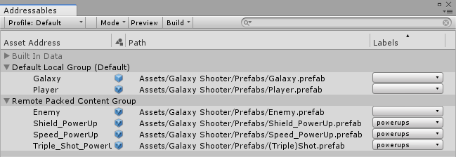

# Getting started with Addressable Assets

## Installing the Addressable Assets package

Requires Unity 2018.2 or later.

To install this package, follow the instructions in the [Package Manager documentation](https://docs.unity3d.com/Packages/com.unity.package-manager-ui@1.7/manual/index.html).

## Marking Assets as addressable

There two ways to  mark an item as an Addressable Asset. Once the Addressable Assets package is installed, you can mark an Asset as addressable in the __Inspector__ window or drag it into the __Addressables__ window.

In the __Inspector__ window for the item, click the __Address__ checkbox and enter a name to identify the Asset.

Open the Addressables window by clicking __Window  &gt; Addressable Assets__.

Drag the item from the Project window’s Asset Folder into the __Addressables__ window’s Asset tab.

When you first start using Addressable Assets, the system saves some edit-time and run-time data Assets for your Project in Assets/AddressableAssetsData which should be added to your version control check in..

### Loading or instantiating by address

You can load or instantiate an Asset at run-time. Loading an Asset loads all dependencies into memory (including Asset bundle data if relevant). This allows you to use the Asset when you need to. Instantiating loads the Asset, and then immediately adds it to the scene.

The default address for an Asset  is the path of the Asset. You can change the address to any unique name.

To access an Asset in script using a string address:

`Addressables.Load<GameObject>("AssetAddress");`

or

`Addressables.Instantiate<GameObject>("AssetAddress");`

### Using the AssetReference Class

The *AssetReference* class provides a mechanism to access Assets without the need to know string (or other) addresses.

To access an Addressable Asset using the *AssetReference *class:

1. Select an Asset.
2. In the Inspector, click the __Add Component__ button and then select the component type.
3. Add a public *AssetReference* object in the component.  For example:

    public AssetReference explosion;

4. In the Inspector, set which Asset the object is linked to by either dragging an Asset from the Project window onto the entry or clicking the entry to choose from previously defined addressable Assets (shown below).

|  |   Begin typing the AssetReference name for easy filtering.  |
|:---|:---|

__Loading an Addressable Asset by object reference__

To load an `AssetReference`, call one of the methods defined on it. For example:

`AssetRefMember.Load<GameObject>();`

or

`AssetRefMember.Instantiate<GameObject>(pos, rot);`