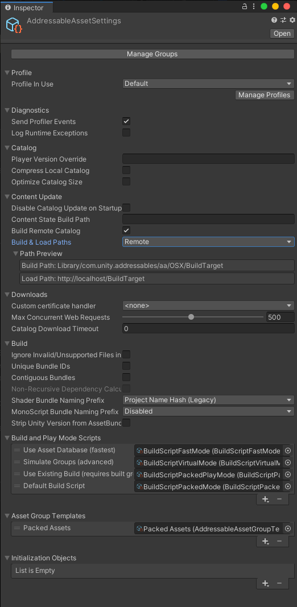

# Addressable Asset Settings
The **Addressable Asset Settings** object defines system settings for your project's Addressables setup.

To access these settings, open the AddressableAssetSettings Inspector (menu: **Window** > **Asset Management** > **Addressables** > **Settings**). You can also select the settings object directly in your Project window at `Assets/AddressableAssetsData/AddressableAssetSettings` after initialising Addressable Assets in your project.

When you perform a content build, the build process saves the settings needed at runtime to the `settings.json` data file. When you run your application in the Editor using the `Use Existing Build (requires built groups)` Playmode Script, you must rebuild your Addressable content to update `settings.json` if you have made changes. If you enter Play mode using the `Use Asset Database (fastest)` or `Simulate Groups (advanced)` scripts, the Addressables system uses the current values in AddressableAssetSettings, so you do not need to rebuild.

 
*Addressable Asset Settings Inspector*

#### Manage Groups
The **Manage Groups** button opens the Groups window. You can also open the Groups window from the menu **Window** > **Asset Management** > **Addressables** > **Groups**. 
For more information see [Getting Started](AddressableAssetsGettingStarted.md).

#### Profile
| **Property:** | **Function:** |
|:---|:---|
| **Profile In Use** | The active profile used to evaluate all profile variables during a build and when entering play mode. |

The **Manage Profiles** button opens the Profiles window. You can also open the Groups window from the menu **Window** > **Asset Management** > **Addressables** > **Profiles**. For more information see [Addressable Assets Profiles](AddressableAssetsProfiles.md).

#### Diagnostics
| **Property:** | **Function:** |
|:---|:---|
| **Send Profiler Events** | Turning this on enables the use of the [Addressables Event Viewer](MemoryManagement.md#the-addressables-event-viewer). |
| **Log Runtime Exceptions** | When enabled, the Addressables system logs runtime exceptions to the [Unity console](xref:Console). Note that the Addressables system does not throw exceptions at runtime when it encounters loading issues, instead it adds to the error state of the IAsyncOperation and, if this flag is enabled, logs the exception. |

#### Catalog
| **Property:** | **Function:** |
|:---|:---|
| **Player Version Override** | Overrides the player version used to generated catalog names. If left blank, the catalog version name is a timestamp of the current UTC time in the form of "Year.Month.Day.Hour.Minute.Second". |
| **Compress Local Catalog** | Whether the local catalog should be serialized in an asset bundle (compressed) or as json (uncompressed). A compressed catalog uses less space on disk, but must be decompressed when loaded, which can increase CPU usage. |
| **Optimize Catalog Size** | Enables size optimization of content catalogs. This can increase CPU usage when loading the catalog. |

#### Content Update
| **Property** | **Function:** |
|:---|:---|
| **Disable Catalog Update on Startup** | Whether the Addressables system should skip the check for an updated content catalog when the Addressables system [initializes](InitializeAsync.md).  Note that you can update the catalog later using [Addressables.UpdateCatalogs](UpdateCatalogs.md). |
| **Content State Build Path** | The path to the folder in which to save the addressables_content_state.bin file. If empty, the file is saved to Assets/AddressableAssetsData. |
| **Build Remote Catalog** | Whether a remote catalog should be built-for and loaded-by the app. When enabled, content builds generate .json and .hash files for the catalog to **Build Path** and the Addressables system loads these files from **Load Path** at runtime. The system caches the catalog and compares the remote .hash file to the cached version to determine if the catalog itself should be updated (along with any changed AssetBundles). In order to update content in an existing, built app, you must build and host a remote catalog. Overwriting the catalog is how the app gets informed of the updated content. See [Profiles](AddressableAssetsProfiles.md) for more information of configuring build and load paths.|
| **- Build & Load Paths** | The pair of paths that determine where to build the content catalog for online retreival and the path or URL from which to load the remote content catalog.  For the build path, typically, this path should be the same as the build path that you use for your remote Addresssables groups, such as the `RemoteBuildPath` profile variable.   For the load path, typically this path should be the same as the load path that you use for your remote Addressables groups, such as the `RemoteLoadPath` profile variable. It is your responsibility to copy or upload the remote catalog files so that your app can access them at the specifiedc location.

#### Downloads
| **Property:** | **Function:** |
|:---|:---|
| **Custom Certificate Handler** | The class to use for custom certificate handling.  This type must inherit from [UnityEngine.Networking.CertificateHandler](xref:Networking.CertificateHandler). |
| **Max Concurrent Web Requests** | The maximum number of concurrent web requests.  This value is be clamped from 1 to 1024. |
| **Catalog Download Timeout** | The number of seconds to wait before a catalog .hash or .json download times out. Set to 0 for no timeout. See [UnityWebRequest.timeout](xref:UnityWebRequest.timeout) for more information.|

#### Build
| **Property:** | **Function:** |
|:---|:---|
| **Ignore Invalid/Unsupported Files in Build** |  Whether unsupported files during build should be ignored or treated as an error. |
| **Unique Bundle IDs** | When enabled, AssetBundles are assigned unique, more complex internal identifiers. This may result in more bundles being rebuilt. See [Content Update Workflow](ContentUpdateWorkflow.md#unique-bundle-ids) for more information. |
| **Contiguous Bundles** | When enabled, the Addressables build script packs assets in bundles contiguously based on the ordering of the source asset, which results in improved asset loading times. Unity recommends that you enable this option. However, enabling this option does result in binary differences in the bundles produced. Disable this option if you've built bundles with a version of Addressables older than 1.12.1 and you want to minimize bundle changes. |
| **Non-recursive Dependency Calculation** | Calculate and build asset bundles using Non-Recursive Dependency calculation methods. This approach helps reduce asset bundle rebuilds and runtime memory consumption. Unity recommends that you enable this option. However, enabling this option does result in binary differences in the bundles produced. **Requires Unity 2019.4.19f1 or above** |
| **Shader Bundle Naming Prefix** | Sets the naming convention used for the Unity built in shader bundle at build time. The recommended setting is Project Name. |
| **- Shader Bundle Custom Prefix** | Custom Unity built-in shader bundle prefix that is used if AddressableAssetSettings.ShaderBundleNaming is set to ShaderBundleNaming.Custom. |
| **Mono Bundle Naming Prefix** | Sets the naming convention used for the MonoScript bundle at build time. A MonoScript contains information for loading the corresponding runtime class. The recommended setting is Project Name |
| **- Mono Bundle Custom Prefix** | Custom MonoScript bundle prefix that is used if AddressableAssetSettings.MonoScriptBundleNaming is set to MonoScriptBundleNaming.Custom. |
| **Strip Unity Version from AssetBundles** | When enabled, Unity Editor Version is stripped from the header of the AssetBundle during a build. |

#### Build and Play Mode Scripts
Displays an orderable list of Build Scripts available to use for building Addressables. When Addressables is first set up for a Project, four Build Scripts are included:

| **Build Script Name:** | **Function:** |
|:---|:---|
| **Use Asset Database (fastest)** | Editor Playmode Script, loads Assets directly from the Project when requested from Addressables. |
| **Simulate Groups (advanced)** | Editor Playmode Script, analyzes content for layout and dependencies without creating AssetBundles. Loads assets from the Asset database through the ResourceManager as if they were loaded through bundles. Simulates download speeds for remote AssetBundles and file loading speeds for local bundles by introducing a time delay. You can use the Addressables [Event Viewer](MemoryManagement.md#the-addressables-event-viewer) with this Play mode script. |
| **Use Existing Build (requires built groups)** | Editor Playmode Script, loads Assets from bundles created by an earlier content build. You must run a full build using a Build Script such as `Default Build Script` before using this option. Remote content must be hosted at the **RemoteLoadPath** of the [Profile](AddressablesProfiles.md) used to build the content. |
| **Default Build Script** | Performs a full build of your Addressables content. |

#### Asset Group Templates
Displays an orderable list of Group Templates. The templates added here are shown in the Groups window, `Create > Group > "Template Name"` when you create a new group. The chosen template determines which schemas are added to your new group. When Addressables is first set up for a Project, a single `Packed Assets` template is included.

| **Template Name:** | **Function:** |
|:---|:---|
| **Packed Assets** | Template for a Group that is setup for default local behavior. |

#### Initialization Objects
Displays an orderable list of [Initialization Objects](AddressableAssetsDevelopmentCycle.md#initialization-objects). You can use InitializationObjects when defining custom Addressables runtime initialization behavior. When Addressables is first set up for a Project no initialization objects are included.

See [`CacheInitializationSettings`](xref:UnityEditor.AddressableAssets.Settings.CacheInitializationSettings) for an example of an InitializationObject.
