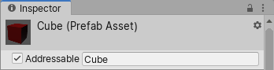

# Getting started
## Installing the Addressable Assets package

**Important**: The Addressable Asset System requires Unity version 2018.3 or later.

To install this package, follow the instructions in the [Package Manager documentation](https://docs.unity3d.com/Packages/com.unity.package-manager-ui@1.7/manual/index.html).

## Preparing Addressable Assets
### Marking assets as Addressable
There are two ways to mark an asset as Addressable in the Unity Editor: 

* In the object's Inspector.
* In the **Addressables Groups** window. 

#### Using the Inspector
In your **Project** window, select the desired asset to view its Inspector. In the Inspector, click the **Addressable** checkbox and enter a name by which to identify the asset.

</br>
_Marking an asset as Addressable in the **Inspector** window._

#### Using the Addressables window
Select **Window** > **Asset Management** > **Addressables** > **Groups** to open the **Addressables Groups** window. Next, drag the desired asset from your **Project** window into one of the asset groups in the **Addressables Groups** window.

</br>
_Marking an asset as Addressable in the **Addressables Groups** window._

### Specifying an address
The default address for your asset is the path to the asset in your Project (for example, _Assets/images/myImage.png_). To change the asset's address from the **Addressables Groups** window, right-click the asset and select **Change Address**.

When you first start using Addressable Assets, the system saves some edit-time and runtime data assets for your Project in the _Assets/AddressableAssetsData_ file, which should be added to your version control check-in.

### Building your Addressable content
The Addressables Asset System needs to build your content into files that can be consumed by the running game before you build the application. This step is not automatic. You can build this content via the Editor or API:

* To build content in the Editor, open the **Addressables Groups** window, then select **Build** > **New Build** > **Default Build Script**.
* To build content using the API, use [`AddressableAssetSettings.BuildPlayerContent()`](../api/UnityEditor.AddressableAssets.Settings.AddressableAssetSettings.html#UnityEditor_AddressableAssets_Settings_AddressableAssetSettings_BuildPlayerContent).

## Using Addressable Assets
### Loading or instantiating by address
You can load or instantiate an Addressable Asset at runtime. Loading an asset loads all dependencies into memory (including the asset's bundle data if applicable), allowing you to use the asset when you need to.  This does not actually put the desired asset into your scene. To add the asset to your scene you must instantiate.  Using Addressables instantiation interfaces will load the asset, then immediately adds it to your Scene. 

To access an asset from your game script using a string address, declare the [`UnityEngine.AddressableAssets`](../api/UnityEngine.AddressableAssets.html) namespace, then call the following methods:

```
Addressables.LoadAssetAsync<GameObject>("AssetAddress");
```

This loads the asset with the specified address.

```
Addressables.InstantiateAsync("AssetAddress");
```

This instantiates the asset with the specified address into your Scene.

**Note**: [`LoadAssetAsync`](../api/UnityEngine.AddressableAssets.Addressables.html#UnityEngine_AddressableAssets_Addressables_LoadAssetAsync__1_System_Object_) and [`InstantiateAsync`](../api/UnityEngine.AddressableAssets.Addressables.html#UnityEngine_AddressableAssets_Addressables_InstantiateAsync_System_Object_Transform_System_Boolean_System_Boolean_) are asynchronous operations. You may provide a callback to work with the asset when it finishes loading (see documentation on [**Async operation handling**](AddressableAssetsAsyncOperationHandle) for more information).

```
using System.Collections;
using System.Collections.Generic;
using UnityEngine.AddressableAssets;
using UnityEngine;

public class AddressablesExample : MonoBehaviour {

    GameObject myGameObject;
   
        ...
        Addressables.LoadAssetAsync<GameObject>("AssetAddress").Completed += OnLoadDone;
    }

    private void OnLoadDone(UnityEngine.ResourceManagement.AsyncOperations.AsyncOperationHandle<GameObject> obj)
    {
        // In a production environment, you should add exception handling to catch scenarios such as a null result.
        myGameObject = obj.Result;
    }
}
```

#### Sub-assets and components
Sub-assets and components are special cases for asset loading.

##### Components 
You cannot load a GameObject's component directly through Addressables. You must load or instantiate the GameObject, then retrieve the component reference from it. To see how you could extend Addressables to support component loading, see [our ComponentReference sample](https://github.com/Unity-Technologies/Addressables-Sample/tree/master/Basic/ComponentReference).

##### Sub-assets
The system supports loading sub-assets, but requires special syntax. Examples of potential sub-assets include sprites in a sprite sheet, or animation clips in an FBX file. For examples of loading sprites directly, see [our sprite loading sample](https://github.com/Unity-Technologies/Addressables-Sample/tree/master/Basic/Sprite%20Land)

To load all sub-objects in an asset, you can use the following example syntax: 
`Addressables.LoadAssetAsync<IList<Sprite>>("MySpriteSheetAddress");`

To load a single sub-object in an asset, you could do this:
`Addressables.LoadAssetAsync<Sprite>("MySpriteSheetAddress[MySpriteName]");`

The names available within an asset are visible in the main Addressables group editor window. 
In addition, you can use an [`AssetReference`](../api/UnityEngine.AddressableAssets.AssetReference.html) to access the sub-object of an asset.  See notes in the below section. 

### Using the AssetReference class
The [`AssetReference`](../api/UnityEngine.AddressableAssets.AssetReference.html) class provides a way to access Addressable Assets without needing to know their addresses. To access an Addressable Asset using the `AssetReference` class:

1. Select a GameObject from your Scene hierarchy or **Project** window.
2. In the Inspector, click the **Add Component** button, then select the component type. Any serializable component can support an `AssetReference` variable (for example, a game script, ScriptableObject, or other serializable class).
3. Add a public `AssetReference` variable in the component (for example, `public AssetReference explosion;`).
4. In the Inspector, select which Addressable Asset to link to the object, by either dragging the asset from the **Project** window into the exposed `AssetReference` field, or choosing from the dropdown of previously defined Addressable Assets in your Project (shown below).

</br>
_Referencing an Addressable Asset via script component._

To load or instantiate an [`AssetReference`](../api/UnityEngine.AddressableAssets.AssetReference.html) asset, call its corresponding method. For example:

```
AssetRefMember.LoadAssetAsync<GameObject>();
```

or

```
AssetRefMember.InstantiateAsync(pos, rot);
```

**Note**: As with normal Addressable Assets, [`LoadAssetAsync`](../api/UnityEngine.AddressableAssets.AssetReference.html#UnityEngine_AddressableAssets_AssetReference_LoadAssetAsync__1) and [`InstantiateAsync`](../api/UnityEngine.AddressableAssets.AssetReference.html#UnityEngine_AddressableAssets_AssetReference_InstantiateAsync_Transform_System_Boolean_) are asynchronous operations. You may provide a callback to work with the asset when it finishes loading (see documentation on [**Async operation handling**](AddressableAssetsAsyncOperationHandle) for more information).

##### Sub-assets
If an asset that contains sub-assets (such as a SpriteAtlas or FBX) is added to an AssetReference, you are given the option to reference the asset itself, or a sub-asset.  The single dropdown you are used to seeing becomes two. The first selects the asset itself, and the second selects the sub-asset. If you select "<none>" in the second dropdown, that will be treated as a reference to the main asset. 


## Build considerations
### Local data in StreamingAssets
The Addressable Asset System needs some files at runtime to know what to load and how to load it. Those files are generated when you build Addressables data and wind up in the _StreamingAssets_ folder, which is a special folder in Unity that includes all its files in the build. When you build Addressables content, the system stages those files in the Library. Then, when you build the application, the system copies the required files over to _StreamingAssets_, builds, and deletes them from the folder. This way, you can build data for multiple platforms while only having the relevant data included in each build. 

In addition to the Addressables-specific data, any groups that build their data for local use will also use the Library platform-specific staging location. To verify that this works, set your build path and load paths to [profile variables](./AddressableAssetsProfiles.md) starting with `[UnityEngine.AddressableAssets.Addressables.BuildPath]` and `{UnityEngine.AddressableAssets.Addressables.RuntimePath}` respectively. You can specify these settings in the `AddressableAssetSettings` Inspector (by default, this object is located in your Project's _Assets/AddressableAssetsData_ directory).

### Downloading in advance
Calling the [`Addressables.DownloadDependenciesAsync()`](../api/UnityEngine.AddressableAssets.Addressables.html#UnityEngine_AddressableAssets_Addressables_DownloadDependenciesAsync_System_Object_System_Boolean_) method loads the dependencies for the address or label that you pass in. Typically, this is the asset bundle.

The [`AsyncOperationHandle`](AddressableAssetsAsyncOperationHandle.md) struct returned by this call includes a `PercentComplete` attribute that you can use to monitor and display download progress. You can also have the app wait until the content has loaded.

If you wish to ask the user for consent prior to download, use [`Addressables.GetDownloadSize()`](../api/UnityEngine.AddressableAssets.Addressables.html#UnityEngine_AddressableAssets_Addressables_GetDownloadSize_System_Object_) to return how much space is needed to download the content from a given address or label. Note that this takes into account any previously downloaded bundles that are still in Unity's asset bundle cache.

While it can be advantageous to download assets for your app in advance, there are instances where you might choose not to do so. For example:

* If your app has a large amount of online content, and you generally expect users to only ever interact with a portion of it.
* You have an app that must be connected online to function. If all your app's content is in small bundles, you might choose to download content as needed.

Rather than using the percent complete value to wait until the content is loaded, you can use the preload functionality to show that the download has started, then continue on. This implementation would require a loading or waiting screen to handle instances where the asset has not finished loading by the time it's needed.

### Building for multiple platforms
The Addressable Asset System generates asset bundles containing your Addressable Assets when building application content. Asset bundles are platform-dependant, and thus must be rebuilt for every unique platform you intend to support.

By default, when building Addressables app data, data for your given platform is stored in platform-specific subdirectories of the Addressables build path(s). The runtime path accounts for these platform folders, and points to the applicable app data.  

**Note**: If you use the Addressables [`BuildScriptPackedPlayMode`](../api/UnityEditor.AddressableAssets.Build.DataBuilders.BuildScriptPackedPlayMode.html) script in the Editor Play mode, Addressables will attempt to load data for your current active build target. As such, issues may arise if your current build target data isn't compatible with your current Editor platform. For more information, see documentation on [Play mode scripts](AddressableAssetsDevelopmentCycle.md#play-mode-scripts).

### Grouping assets
It is a good practice to logically collect assets into multiple groups rather than put them all in one large group. The key benefit of this method is to avoid conflicts in version control systems (VCS) when multiple contributors make edits to the same file. Having one large asset group might result in the VCS's inability to cleanly merge these various changes.

### Building scenes that are packed together
After running a build where you have multiple Scenes in an Addressable Assets group, those Scenes will become interdependent if:
* Under _Packed Assets_ in the Project window, the group's Bundle Mode is set to **Pack Together**.
* The Scenes in that group all have the same asset label, and the Bundle Mode is set to **Pack Together By Label**.

If you modify even one of these grouped Scenes then perform a [content update build](AddressableAssetsDevelopmentCycle.md#building-for-content-updates), all the interdependent Scenes will move together into a new Content Update group.

### Loading Content Catalogs
Content Catalogs are the data stores Addressables uses to look up an asset's physical location based on the key(s) provided to the system.  By default, Addressables builds the local content catalog for local Addressable Groups.  If the Build Remote Catalogs option is turned on under the AddressableAssetSettings, then one additional catalog is built to store locations for remote Addressable Groups.  Ultimately Addressables only uses one of these catalogs.  If a remote catalog is built and it has a different hash than the local catalog, it is downloaded, cached, and used in place of the built-in local catalog.

It is possible, however, to specify additional Content Catalogs to be loaded.  There are different reasons you might decide loading additional catalogs is right for your project, such as building an art-only project that you want to use across different projects.

Should you find that loading additional catalogs is right for you, there is a method that can assist in this regard, `LoadContentCatalogAsync`.  

For `LoadContentCatalogAsync`, all that is required is for you to supply the location of the catalog you wish to load.  However, this alone does not use catalog caching, so be careful if you're loading a catalog from a remote location.  You will incur that WebRequest every time you need to load that catalog.

To help prevent you from needing to download a remote catalog every time, if you provide a `.hash` file with the hash of the catalog alongside the catalog you're loading, we can use this to properly cache your Content Catalog.  **Please Note:** The hash file does need to be in the same location and have the same name as your catalog.  The only difference to the path should be the extension.

One additional note: You'll notice this method comes with a parameter `autoReleaseHandle`.  In order for the system to download a new remote catalog, any prior calls to `LoadContentCatalogAsync` that point to the catalog you're attempting to load need to be released.  Otherwise, the system picks up the Content Catalog load operation from our operation cache.  If the cached operation is picked up, the new remote catalog is not downloaded.  If set to true, the parameter `autoReleaseHandle` can ensure that the operation doesn't stick around in our operation cache after completing.