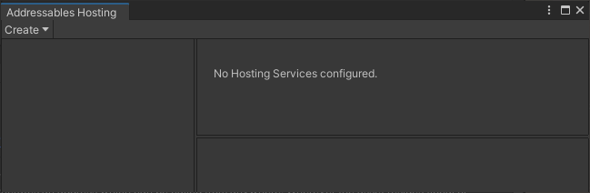
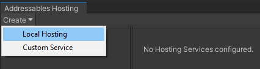
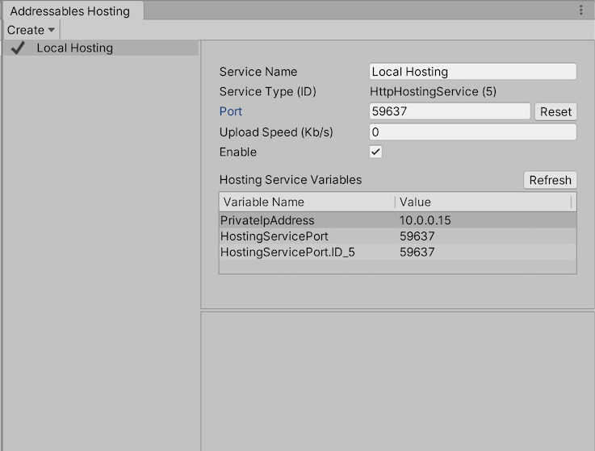
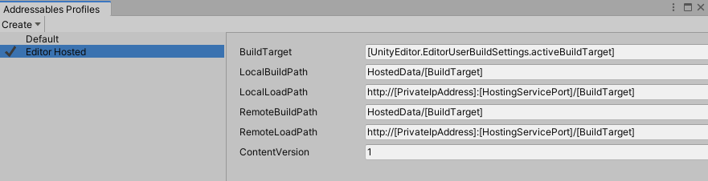
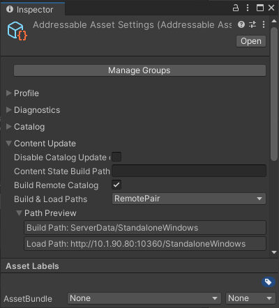
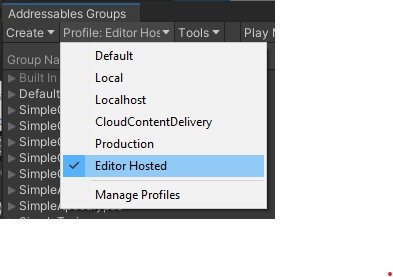
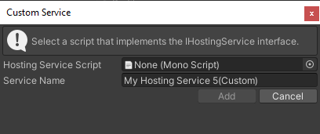

# Asset Hosting Services
## Overview
Hosting Services provide an integrated facility for using Addressable Assets configuration data to serve packed content to local or network-connected application builds from within the Unity Editor. Hosting Services are designed to improve iteration velocity when testing packed content, and can also be used to serve content to connected clients on local and remote networks.

### Packed mode testing and iteration
Moving from Editor Play mode testing to platform application build testing introduces complexities and time costs to the development process. Hosting Services provide extensible Editor-embedded content delivery services that map directly to your Addressables group configuration. Using a custom Addressables profile, you can quickly configure your application to load all content from the Unity Editor itself. This includes builds deployed to mobile devices, or any other platform, that have network access to your development system.

### Turn-key content server
You can deploy Asset Hosting Services into a server environment by running in batch mode (headless) to host content for both intranet- and internet-facing Unity application clients.

## Setup
This article details the initial setup of Asset Hosting Services for your Project. While the setup guide focuses on Editor workflows, you can use the API to configure Hosting Services by setting the [`HostingServicesManager`](../api/UnityEditor.AddressableAssets.HostingServices.HostingServicesManager.html) property of the [`AddressableAssetSettings`](../api/UnityEditor.AddressableAssets.Settings.AddressableAssetSettings.html) class.

### Configuring a new Hosting Service
Use the **Hosting window** to add, configure, and enable new Hosting Services. In the Editor, select **Window** > **Asset Management** > **Addressables** > **Hosting**, or click the **Tools** > **Hosting Services** button from the **Addressables Groups** window menu to access the **Addressables Hosting** window.

</br>
_The **Addressables Hosting** window._

To add a new Local Hosting Service, click the **Create** > **Local Hosting** button.

</br>
_Adding a new Hosting Service._

**Note**: For more information on implementing custom hosting service types, see the section on [custom services](#custom-services).

The newly added service appears in the **Hosting Services** section of the **Addressables Hosting** window. Use the **Service Name** field enter a name for the service.

The new service defaults to the disabled state. To initiate the service, select the **Enable** check box.

</br>
_The updated **Addressables Hosting** window after adding a service._

The HTTP Hosting Service automatically assigns a port number when it starts. The port number is saved and reused between Unity sessions. To choose a different port, either assign a specific port number in the **Port** field, or use the **Reset** button to randomly assign a different port.

**Note**: If you reset the port number, you must execute a full application build to generate and embed the correct URL.

The HTTP Hosting Service is now enabled and ready to serve content from the directory specified in the [`BuildPath`](../api/UnityEditor.AddressableAssets.Settings.GroupSchemas.BundledAssetGroupSchema.html?q=buildpath#UnityEditor_AddressableAssets_Settings_GroupSchemas_BundledAssetGroupSchema_BuildPath) of each asset group.

### Hosting Service profile setup
When working with Hosting Services during development, Unity recommends creating a profile that configures all asset groups to load content from the Hosting Service using a directory or directories created specifically for that purpose. For more about profiles, see [Addressable Assets Profiles](./AddressableAssetsProfiles.md).

Once in the **Addressables Profiles** window, create a new profile via **Create** > **Profile**. In the following example, the new profile is called "Editor Hosted".

</br>
_Creating a service profile._

Modify the loading path fields to instead load from the Hosting Service. [`HttpHostingService`](../api/UnityEditor.AddressableAssets.HostingServices.HttpHostingService.html) is a URL that uses the local IP address and the port assigned to the service. From the **Addressables Hosting** window, you can use the profile variables named `PrivateIpAddress` and `HostingServicePort` to construct the URL (for example, `http://[PrivateIpAddress]:[HostingServicePort]`).

Additionally, you should modify all build path variables to point to a common directory outside of the Project's _Assets_ folder.

</br>
_Configuring the service's profile._

Verify that each group is configured correctly. Ensure that the [`BuildPath`](../api/UnityEditor.AddressableAssets.Settings.GroupSchemas.BundledAssetGroupSchema.html?q=buildpath#UnityEditor_AddressableAssets_Settings_GroupSchemas_BundledAssetGroupSchema_BuildPath) and [`LoadPath`](../api/UnityEditor.AddressableAssets.Settings.GroupSchemas.BundledAssetGroupSchema.html?q=buildpath#UnityEditor_AddressableAssets_Settings_GroupSchemas_BundledAssetGroupSchema_LoadPath) paths are set to their respective profile keys that are modified for use with Hosting Services. In this example, you can see how the profile variables in the [`LoadPath`](../api/UnityEditor.AddressableAssets.Settings.GroupSchemas.BundledAssetGroupSchema.html?q=buildpath#UnityEditor_AddressableAssets_Settings_GroupSchemas_BundledAssetGroupSchema_LoadPath) are expanded to build a correct base URL for loading from Hosted Services.

</br>
_Inspecting the service's load paths._

Finally, select the new profile from the **Addressables Groups** window, create a build, and deploy to the target device. The Unity Editor now serves all load requests from the application through the [`HttpHostingService`](../api/UnityEditor.AddressableAssets.HostingServices.HttpHostingService.html) service. You can now make additions and changes to content without redeployment. Rebuild the Addressable content, and relaunch the already deployed application to refresh the content.

</br>
_Selecting a Hosting Service profile._

### Batch mode
You can also use Hosting Services to serve content from the Unity Editor running in batch mode. To do so, launch Unity from the command line with the following options:

```
-batchMode -executeMethod UnityEditor.AddressableAssets.HostingServicesManager.BatchMode
```

This loads the Hosting Services configuration from the default [`AddressableAssetSettings`](../api/UnityEditor.AddressableAssets.Settings.AddressableAssetSettings.html) object, and starts all configured services.

To use an alternative [`AddressableAssetSettings`](../api/UnityEditor.AddressableAssets.Settings.AddressableAssetSettings.html) configuration, create your own static method entry point, to call through the [`UnityEditor.AddressableAssets.HostingServicesManager.BatchMode(AddressableAssetSettings settings)`](../api/UnityEditor.AddressableAssets.HostingServices.HostingServicesManager.html#UnityEditor_AddressableAssets_HostingServices_HostingServicesManager_BatchMode_UnityEditor_AddressableAssets_Settings_AddressableAssetSettings_) overload.

<a name="custom-services"></a>
## Custom services
Hosting Services are designed to be extensible, allowing you to implement your own custom logic for serving content-loading requests from the Addressable Assets System. For example:

* Support a custom [`IResourceProvider`](../api/UnityEngine.ResourceManagement.ResourceProviders.IResourceProvider.html) that uses a non-HTTP protocol for downloading content.
* Manage an external process for serving content that matches your production CDN solution (such as an Apache HTTP server).

### Implementing a custom service
The [`HostingServicesManager`](../api/UnityEditor.AddressableAssets.HostingServices.HostingServicesManager.html) can manage any class that implements an [`IHostingService`](../api/UnityEditor.AddressableAssets.HostingServices.IHostingService.html) interface (for more details on method parameters and return values, see the [API documentation](../api/UnityEditor.AddressableAssets.IHostingService.html).

To create a new custom service:

1. Follow the steps outlined in the [configuring a new Hosting Service](#configuring-a-new-hosting-service) section above, but instead of selecting **Create** > **Local Hosting** button, select **Create** > **Custom Service** button instead. 
2. Drag and drop the applicable script into its field, or select it from the object picker. The dialog validates that the selected script implements the [`IHostingService`](../api/UnityEditor.AddressableAssets.HostingServices.IHostingService.html) interface. 
3. To finish adding the service, click the **Add** button. 

Moving forward, your custom service will appear in the **Service Type** dropdown options.

</br>
_Adding a custom Asset Hosting Service._
