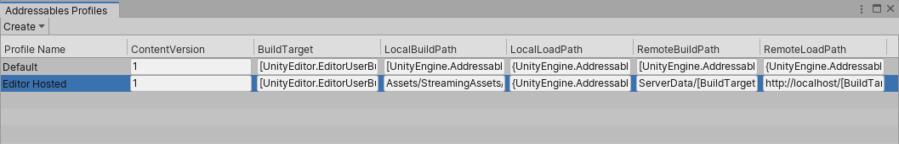
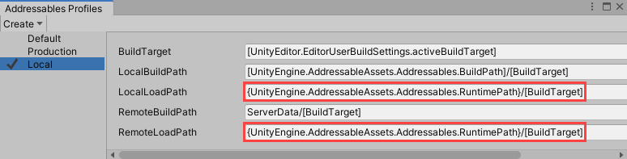

# Addressable Assets Profiles
The Addessable Assets Profile system allows you to create a set of string variables that more easily enables you to change how your content is built into bundles. These variables can be used to determine whether your content is local to device or on a remote server.

For each profile, you specify values for each variable. This way, instead of manually changing the individual paths for each of your build scenarios, you can change profiles to swap them all at once.

## Profile Setup

There are multiple ways to access the Profile setup window in the Editor.
* Select **Windows** > **Asset Management** > **Addressables** > **Profiles**.
* Select **Windows** > **Asset Management** > **Addressables** > **Groups**, then select **Tools** > **Profiles**.
* Select **Windows** > **Asset Management** > **Addressables** > **Groups**, then select **Profile** > **Manage Profiles**..
* You can also access these settings via the `AddressableAssetSettings` Inspector.

 
_The **Addressables Profiles** window showing two profiles._

There are five variables we provide by default:
* BuildTarget
* LocalBuildPath
* LocalLoadPath
* RemoteBuildPath
* RemoteLoadPath

 You can add or remove variables at any time.

### Adding a new profile
You can create new profile by selecting **Create** > **Profile**. A new profile row appears in the table.

Right-click the profile name to select whether to set this as the active profile, rename the profile, or delete it.

Every profile must define a value for every variable. When you create a new profile, all values are copied from the currently selected profile.

### Adding a new variable
You can create new variables to add to the default set by selecting **Create** > **Variable**. In the resulting window, give the new variable a name and string value, then click **Save**. The new variable appends to the end of the variable table.

Right-click the variable name to rename or delete the variable. You can likewise rename or delete the provided variables.

### Syntax
All variables are of type "string". In general, you can type in exactly the needed path or value, but there are two additional syntax designators allowed:
* Square brackets [ ]. Items surrounded by square brackets are evaluated at build time. The values inside can be other profile variables (such as [BuildTarget]) or code variables (such as [UnityEditor.EditorUserBuildSettings.activeBuildTarget]). During build time, as the groups are being processed, the items inside square brackets are evaluated and the resulting string is written into the catalog.
* Curly brackets { }. Items surrounded by curly brackets are evaluated at runtime. Generally values here will be code variables (such as {UnityEngine.AddressableAssets.Addressables.RuntimePath}).
 For example, you have a load path of: _{MyNamespace.MyClass.MyURL}/content/[BuildTarget]}_
set on a group that is creating an asset bundle called "trees.bundle". During the build, the catalog would register the load path for that bundle as _{MyNamespace.MyClass.MyURL}/content/Android/trees.bundle}_. Then, at startup, as the catalog is being processed, the profile system would evaluate MyNamespace.MyClass.MyURL to end up with the final load path of `http://myinternet.com/content/Android/trees.bundle`.

## Specifying packing and loading paths
Once you set up the necessary variables in your profile, you can select the build and load paths for an asset group based on those specified variables.

To set your build and load paths:

1. Select an Addressable Assets group from the **Project** window.
2. In its related **Inspector** window, under **Content Packing & Loading** > **Build and Load Paths**, select the desired variables from the currently set profile in the drop-downs for **Build Path** and **Load Path**.  Notice that you do not enter the path directly, but rather select the variable representing the path defined in the **Profiles** window earlier. Once selected, the path displays under the drop-down but is not editable here.  Be careful to ensure the build and load paths are a matched pair. For example, if you are building to the local path, you cannot load from a server.

## Examples
Consider the following example, demonstrating the local development phase of your content. 

 
_Content with local and remote bundles stored locally for development._

While in development, you would have both your local and remote bundles using local paths, as seen in the "Local" row below.

 
_Paths set for local development and production._

In this instance, you can see that the local and remote paths are in fact local, which makes more sense for development, as setting up a remote server would be a pain. However, once the content is ready for production, you would move the remote bundles to a server, as the diagram below shows.

 
_Content with remote bundle moved to a server for production._

In this case, using profiles, you could change the remote load path for "Production" to that server. Without having to change your asset groups, you can change all of your remote bundles to actually become remote.