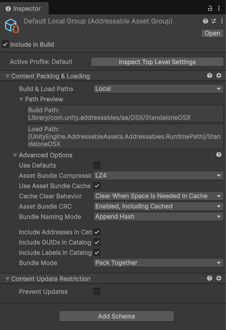

# Define group settings

Configure group settings using schema objects that control how Unity treats assets during content builds, including custom schema creation.

Group settings set how Unity treats the assets in a group in content builds. Group settings control properties such as the location where Unity builds AssetBundles or bundle compression settings.

To open a group's settings, open the [Addressables Groups window](GroupsWindow.md) (**Window &gt; Asset Management &gt; Addressables &gt; Groups**), then select a group. The group's settings are displayed in the Inspector.

A group's settings are declared in schema objects attached to the group. When you create a group with the [Packed Assets template](xref:group-templates), the **Content Packing & Loading** and **Content Update Restriction** schemas define the settings for the group. The default [Build scripts](xref:addressables-builds) expect these settings.

> [!NOTE]
> If you create a group with the **Blank** template, then Unity doesn't attach any schemas to the group. The default build script can't process assets in a blank group.

<br/>*The Inspector window for the Default Local Group.*


## Schemas

A group schema is a [`ScriptableObject`](xref:um-class-scriptable-object) that defines a collection of settings for an Addressables group. You can assign any number of schemas to a group and also create custom schemas to support your own build scripts and utilities.

The built-in schemas include:

* __Content Packing & Loading__: The main Addressables schema used by the default build script and defines the settings for building and loading Addressable assets.
* __Content Update Restrictions__: Defines settings for making differential updates of an earlier build.

> [!NOTE]
> If you use the default build script, a group must use the __Content Packing & Loading__ schema. If you use content update builds, a group must include the __Content Update Restrictions__ schema. For more information, refer to [Builds](xref:addressables-builds).

For information on these settings, refer to [Content packing settings reference](ContentPackingAndLoadingSchema.md).

## Create a custom schema

To create your own schema, extend the [`AddressableAssetGroupSchema`](xref:UnityEditor.AddressableAssets.Settings.AddressableAssetGroupSchema) class, which is a kind of `ScriptableObject`:

```c#
using UnityEditor.AddressableAssets.Settings;

public class CustomSchema : AddressableAssetGroupSchema
{
   public string CustomDescription;
}
```

Once you have defined a custom schema object, you can add it to existing groups and group templates using the **Add Schema** button in the Inspector window.

In a build script, you can access the schema settings for a group using its [`AddressableAssetGroup`](xref:UnityEditor.AddressableAssets.Settings.AddressableAssetGroup) object.

## Additional resources

* [Content packing settings reference](ContentPackingAndLoadingSchema.md).

