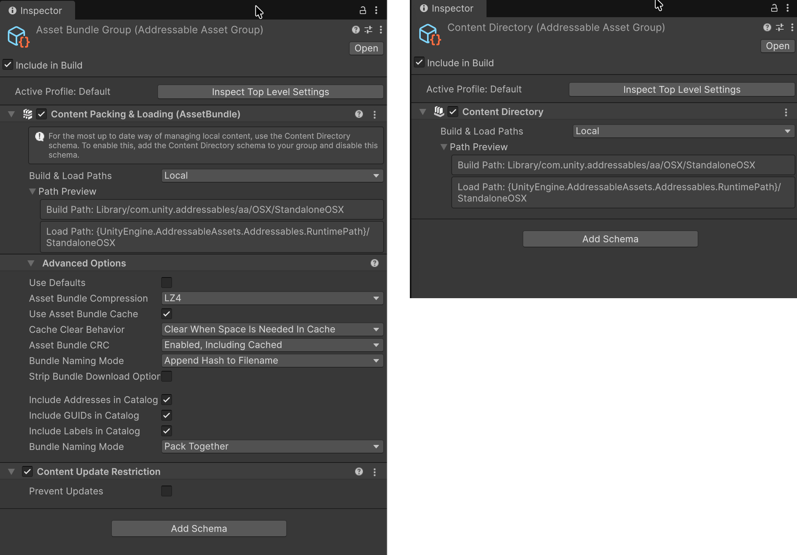

# Define group settings

Use schema objects to configure group settings that control how Unity treats assets during content builds.

Group settings define how Unity treats the assets in a group in content builds. Group settings control properties such as the location where Unity creates a content build, or AssetBundle compression settings.

## Schemas

A group schema is a [`ScriptableObject`](xref:um-class-scriptable-object) that defines a collection of settings for an Addressables group. You can assign any number of schemas to a group and also create custom schemas to support your own build scripts and utilities.

The built-in schemas are as follows:

* __Content Directory__: Defines the settings for building and loading Addressable assets using the content directory system. Select this option for new projects with assets that you plan on distributing locally.
* __Content Packing & Loading__: Defines the settings for building and loading Addressable assets using the AssetBundle system. Select this option if you're using an older project that uses AssetBundles, or you want to distribute assets remotely.
* __Content Update Restrictions__: Defines settings for making differential updates of an earlier build.

> [!NOTE]
> If you use the default build script, a group must use the __Content Directory__ or the __Content Packing & Loading__ schema. If you use content update builds, a group must include the __Content Update Restrictions__ schema. For more information, refer to [Builds](xref:addressables-builds).

For information on these settings, refer to [Content packing settings reference](group-inspector-settings-reference.md).

## Change group settings

To open a group's settings, open the [Addressables Groups window](GroupsWindow.md) (**Window &gt; Asset Management &gt; Addressables &gt; Groups**), then select a group. The group's settings are displayed in the Inspector.

<br/>*The Inspector window for a group using the Content Packing & Loading schema (left), and the Content Directory schema (right).*

A group's settings are declared in schema objects attached to the group. For example, when you create a group with the [Packed Assets template](GroupTemplates.md), the **Content Packing & Loading** and **Content Update Restriction** schemas define the settings for the group. The default [Build scripts](xref:addressables-builds) expect these settings.

## Create a custom schema

To create your own schema, extend the [`AddressableAssetGroupSchema`](xref:UnityEditor.AddressableAssets.Settings.AddressableAssetGroupSchema) class, which is a kind of `ScriptableObject`:

```c#
using UnityEditor.AddressableAssets.Settings;

public class CustomSchema : AddressableAssetGroupSchema
{
   public string CustomDescription;
}
```

Once you have defined a custom schema object, you can add it to existing groups and group templates using the **Add Schema** button in the Inspector window.

In a build script, you can access the schema settings for a group using its [`AddressableAssetGroup`](xref:UnityEditor.AddressableAssets.Settings.AddressableAssetGroup) object.

## Additional resources

* [Content packing settings reference](group-inspector-settings-reference.md).

