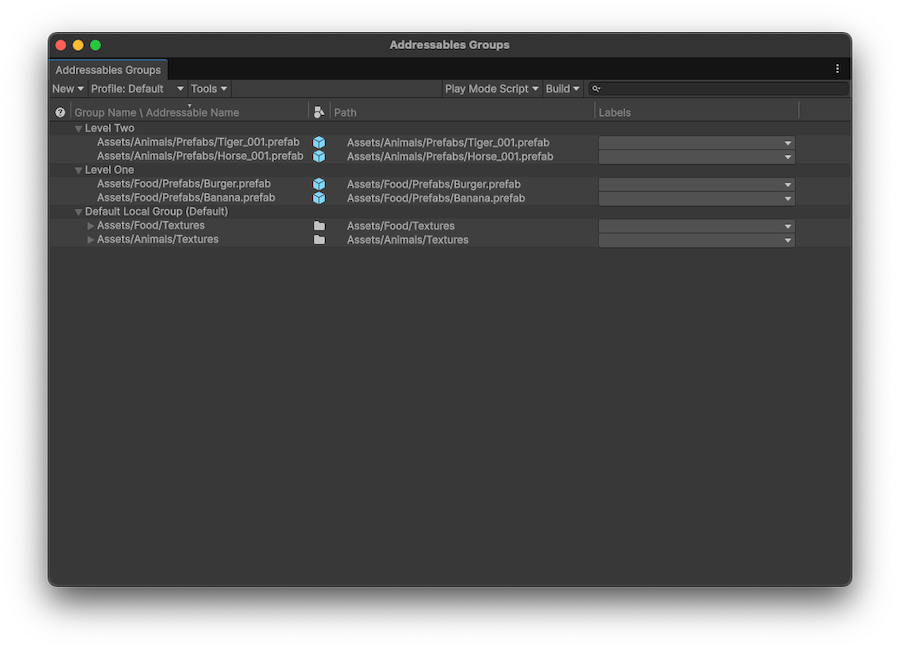

# Addressables Groups window reference

Reference for the Addressables Groups window interface.

Use the Addressables Groups window [to manage groups](groups-create.md) and Addressable assets. To open the window, go to **Window** &gt; **Asset Management** &gt; **Addressables** &gt; **Groups**.

The Groups window also serves as a central location for starting content builds and accessing the tools and settings of the Addressables system.

  *The Addressables Groups window showing the toolbar and list of groups and assets.*

## Group list

The group list displays the Addressable groups in your project. Expand a group in the list to display the assets that it contains. You can also expand composite assets, such as sprite sheets, to display the objects they contain.

| **Column**|**Description** |
|---|---|
| __Notifications__| Any notifications about a group or asset flagged during the build.|
| __Group Name \ Addressable Name__| The name of the item. For groups, this is an arbitrary name that you can assign. For assets, this is the Addressable address. To edit the name or address, use the context menu. |
| __Icon__| The Unity asset icon based on asset type. |
| __Path__| The path to the source asset in your project. |
| __Labels__| Displays any labels assigned to the asset. Click on a label entry to change the assigned labels or to manage label definitions. |

To sort the assets displayed in the group list, select one of the column headers. This sorts the assets within each group, but doesn't reorder the groups. To change the order that the groups are displayed, drag them into the desired position.

## Groups window toolbar

The toolbar at the top of the window contains the following settings:

### New

Choose a template to create a new group, or blank for no schema. For information about creating your own templates, refer to [Group templates](xref:group-templates).

### Profile

Set the active [profile](profiles-introduction.md) to select the paths used for building and loading Addressables. Choose an existing profile or select __Manage Profiles__ to open the [Profiles window](xref:addressables-profiles).

### Tools

Open the various Addressables tools available.

|**Addressables tool**|**Description**|
|---|---|
| __Inspect System Settings__| Open the [Addressables Settings](xref:addressables-asset-settings) Inspector.|
| __Check for Content Update Restrictions__| Run a pre-update content check. For more information, refer to [Update Restrictions](xref:addressables-content-update-builds).|
| __Window__| Open other Addressables system windows:<ul><li>[Profiles](xref:addressables-profiles)</li><li>[Labels](xref:addressables-labels)</li><li>[Addressables Report](addressables-report-window.md)</li></ul>|
|__Groups View__| Set Group window display options:<ul><li>__Show Sprite and Subobject Addresses__: Displays sprite and sub objects in the **Group** list. Disable to display only the parent object.</li><li>__Group Hierarchy with Dashes__: Enable to display groups that contain dashes `-` in their names as if the dashes represented a group hierarchy. Enabling this option affects the group display only. For more information, refer to [Group optimization for large projects](PackingGroupsAsBundles.md#group-optimization-for-large-projects).|

### Play Mode Script

Set the active Play Mode Script. The active Play Mode Script determines how Addressables are loaded in the Editor Play mode.

The active Play Mode Script determines how the Addressable system accesses Addressable assets when you run your game in Play mode. When you select a Play Mode Script, it remains the active script until you choose a different one. The Play Mode Script has no effect on asset loading when you build and run your application outside the Unity Editor.

Choose from the following:

|**Play Mode Script**|**Description**|
|---|---|
| __Use Asset Database__| Loads assets directly from the Editor Asset Database, which is also used for all non-Addressable assets. You don't have to build Addressable content when using this option.|
| __Use Existing Build__| Loads assets from bundles created by an earlier content build. You must run a full build using a Build Script such as [Default Build Script](xref:addressables-builds) before using this option. Remote content must be hosted at the __RemoteLoadPath__ of the profile used to build the content.|

### Build

Select a content build command:

|**Build command**|**Description**|
|---|---|
|__New Build__| Choose a build script to run a full content build.
|__Update a Previous Build__| Run a differential update based on an earlier build.|
| __Clear Build Cache__| Choose a command to clean existing build artifacts. For more information, refer to [Builds](xref:addressables-builds).|

## Search bar

Use the search bar to locate an Addressable asset in the Groups window. Type all or part of its address, path, or a label into the search bar.

 *Filtering the group list by the string "NP" to find all assets labeled NPC*

To locate the asset in your project, select it in the Groups window. Unity then selects the asset in the Project window and displays the asset's details in the Inspector window.

To view the groups of the assets found, enable __Hierarchical Search__. Disable this option to only display groups if they match the search string. To enable or disable __Hierarchical Search__, select the magnifying glass icon in the search box.

## Context menus

You can right-click on the window, a group, or an asset to display additional commands.

### Window context menu

Right-click on an empty area of the window to access the following:

|**Command**|**Description**|
|---|---|
|**Create New Group**|Create a new group from an existing template.|
|**Clear Content Update Warnings**|Clears any warnings related to content updates.|

### Group context menu

To open the group context menu and access group-related commands, right-click on a group name.

| **Command**| **Description** |
|:---|:---|
| __Remove Group(s)__| Removes the Group and deletes its associated ScriptableObject asset. Unity reverts any assets in the group into non-Addressable assets. Not available for the default group. |
| __Simplify Addressable Names__| Shortens the name of assets in the group by removing path-like components and extensions. |
| __Set as Default__| Sets the group as the default group. When you mark an asset as Addressable without explicitly assigning a group, Unity adds the asset to the default group. |
| __Inspect Group Settings__| Selects the group asset in the Unity Project window and in the Inspector window so that you can view the settings. |
| __Rename__| Enables you to edit the name of the group. |
| __Create New Group__| Creates a new group based on a group template. |
|**Clear Content Update Warnings**|Clears any warnings related to content updates.|

### Asset context menu

To open the Addressable asset context menu and access asset-related commands, right-click on an asset.

| **Command**| **Description** |
|:---|:---|
| __Move Addressables to Group__| Move the selected assets to a different, existing group. |
| __Move Addressables to New Group with settings from__| Create a new group based on the settings of an existing group, and move the selected assets to it.|
| __Remove Addressables__| Remove the selected assets from the group and make the assets non-Addressable.  |
| __Simplify Addressable Names__| Shortens the names of the selected assets by removing path-like components and extensions. |
| __Copy Address to Clipboard__| Copies the asset's assigned address string to your system Clipboard. |
| __Change Address__| Edit the asset's name. |
| __Create New Group__| Create a new group based on a group template. This doesn't move the selected assets. |
|**Clear Content Update Warnings**|Clears any warnings related to content updates.|

## Additional resources

* [Content packing settings reference](ContentPackingAndLoadingSchema.md)
* [Addressables Asset Settings reference](AddressableAssetSettings.md)
* [Addressables Preferences reference](addressables-preferences.md)
