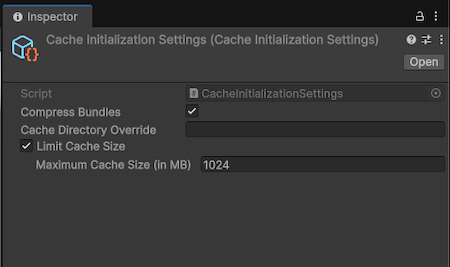

# Addressables initialization process

The Addressables system initializes itself at runtime the first time you load an Addressable asset or make another call to an Addressable API. Call [`Addressables.InitializeAsync`](xref:UnityEngine.AddressableAssets.Addressables.InitializeAsync*) to initialize Addressables earlier. This method does nothing if initialization has already happened.

## Initialization tasks

The initialization operation performs the following tasks:

* Sets up the [`ResourceManager`](xref:UnityEngine.ResourceManagement.ResourceManager) and the [`ResourceLocators`](xref:UnityEngine.AddressableAssets.ResourceLocators).
* Loads configuration data that Addressables creates from [StreamingAssets](xref:um-streaming-assets).
* Executes any [initialization object](AddressableAssetSettings.md#initialization-objects) operations.
* Loads the content catalog. By default, Addressables first checks for updates to the content catalog and downloads a new catalog if available.

The following Addressables settings can change initialization behavior:

* [Only update catalogs manually](AddressableAssetSettings.md#catalog): Addressables doesn't automatically check for an updated catalog. Refer to [Update catalogs](LoadContentCatalogAsync.md#update-catalogs) for information about manually updating catalogs.
* [Build Remote Catalog](AddressableAssetSettings.md#catalog): Addressables doesn't try to load remote content without a remote catalog.
* [Custom certificate handler](AddressableAssetSettings.md#downloads): Identify a custom certificate handler if you need one to access a remote asset hosting service.
* [Initialization object list](AddressableAssetSettings.md#initialization-objects): Add the [`IObjectInitializationDataProvider`](xref:UnityEngine.ResourceManagement.Util.IObjectInitializationDataProvider) ScriptableObject to your application that Addressables invokes during the initialization operation.

Set the following runtime properties before the initialization operation starts:

* [Custom URL transform function](TransformInternalId.md).
* [ResourceManager exception handler](xref:UnityEngine.ResourceManagement.ResourceManager.ExceptionHandler).
* Static properties used for any custom runtime placeholders in [Profile variables](ProfileVariables.md).

## Initialization objects

You can attach objects to the Addressable Assets settings and pass them to the initialization process at runtime. For example, you can create a [`CacheInitializationSettings`](xref:UnityEditor.AddressableAssets.Settings.CacheInitializationSettings) object to initialize Unity's [`Cache`](xref:UnityEngine.Cache) settings at runtime.

To create your own types of initialization object, create a ScriptableObject that implements the [`IObjectInitializationDataProvider`](xref:UnityEngine.ResourceManagement.Util.IObjectInitializationDataProvider) interface. Use this object to create the [`ObjectInitializationData`](xref:UnityEngine.ResourceManagement.Util.ObjectInitializationData) asset that Addressables includes with your the runtime data.

### Cache initialization objects

Use a [`CacheInitializationSettings`](xref:UnityEditor.AddressableAssets.Settings.CacheInitializationSettings) object to initialize Unity's [`Cache`](xref:UnityEngine.Cache) settings at runtime.

To specify the cache initialization settings that the Addressables system uses:

1. Create a Cache Initialization Settings asset (menu: __Assets > Create > Addressables > Initialization > Cache Initialization Settings__).
1. Select the new asset file in the Project panel to view the settings in the Inspector and adjust the settings as desired.
1. Open the Addressables Settings Inspector (menu: __Window > Asset Management > Addressables > Settings__).
1. In the __Initialization Objects__ section of the Inspector, click the __+__ button to add a new object to the list.
1. Select the CacheInitializationSettings asset in the File dialog and click __Open__.

The cache settings object is added to the list. When Addressables initializes at runtime, it applies these settings to the default Unity `Cache`. The settings apply to all AssetBundles in the default cache, not just those downloaded by the Addressables system. For more information about the Unity cache system, refer to [Caching](xref:UnityEngine.Caching).

> [!TIP]
> Android applications built with Unity 2020.1 or earlier, or running on Android 9 or earlier can only play videos from uncompressed AssetBundles. To disable recompression of the cache, use a `CacheInitializationSettings` object by disabling the __Compress Bundles__ option.

## Additional resources

* [Addressables Asset Settings reference](AddressableAssetSettings.md)
* [`Addressables.InitializeAsync` API reference](xref:UnityEngine.AddressableAssets.Addressables.InitializeAsync*)