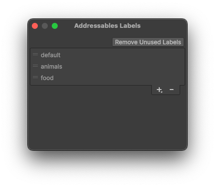

# Labels overview

You can tag your Addressable assets with one or more labels in the [Addressables Groups](xref:addressables-groups) window. Labels have a few uses in the Addressables system, including:

* You can use one or more labels as keys to identify which assets to load at runtime.
* You can pack assets in a group into AssetBundles based on their assigned labels.
* You can use labels in the filter box of the Groups window to help find labeled assets

When you load assets using a list of labels, you can specify whether you want to load all assets that have any label in the list or only assets that have every label in the list.

For example, if you used the labels, `characters` and `animals` to load assets, you could choose to load the union of those two sets of assets, which includes all characters and all animals, or the intersection of those two sets, which includes only characters that are animals. Refer to [Loading multiple assets](load-assets.md#load-multiple-assets) for more information.

When you choose to pack assets in a group based on their assigned labels using the group [Bundle Mode](xref:addressables-content-packing-and-loading-schema) setting, the Addressables build script creates a bundle for each unique combination of labels in the group. For example, if you have assets in a group that you have labeled as either `cat` or `dog` and either `small` or `large`, the build produces four bundles: one for small cats, one for small dogs, one for large cats, and another for large dogs.

## Managing labels

To create and delete labels, use the Labels window, which is accessible from the [Addressables Groups window](GroupsWindow.md) (**Window &gt; Asset Management &gt; Addressables &gt; Groups &gt; Tools &gt; Windows &gt; Labels**).

 *The Labels window.*

To create a new label, select the __+__ button at the bottom of the list. Enter the new name and click __Save__.

To delete a label, select it in the list and then select the __-__ button. Deleting a label also removes it from all assets.

> [!TIP]
> Until you run an Addressables build, you can undo the deletion of a label by adding it back to the Labels dialog (using the exact same string). This also adds the label back to its original assets. After you run an Addressables build, however, re-adding a deleted label no longer reapplies it to any assets.
