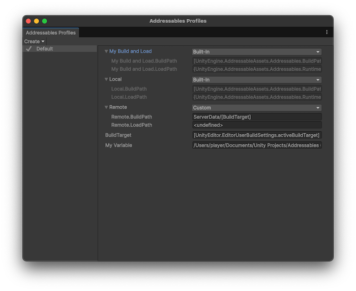

# Add variables to a profile

Profile variables are generic key/value combinations that you can use to change Addressables configurations for different development situations.

You can add the following kinds of variables to a profile:

* **Variable**: A basic variable, which defines a single value
* **Build and Load Path Variable**: A path pair, which defines a set of two path values. One value is for the build path and one is for the load path.

You can use basic variables as components of path values (for example, **BuildTarget**) and you can use them in your own build scripts. Use path pair variables to set the **Build & Local Paths** setting of your [groups](groups-intro.md) and remote catalog.

## Create a new profile variable

To create a new profile variable:

1. Open the [Addressables Profiles window](addressables-profiles-window.md)(**Window** > **Asset Management** > **Addressables** > **Profiles**).
1. Select the **Create** menu, and select either **Variable** or **Build and Load Path Variable**.
1. Assign the new variable a name and value, then select **Save**.

Unity then adds the new variable to all profiles. Right-click on the variable name to rename or delete the variable. For information on the default paths, refer to [Default variable paths](profiles-default-paths.md).

 *The __Addressables Profiles__ displaying a custom build and load path variable (My Build and Load), and a single variable (My Variable).*

> [!TIP]
> You can convert two regular variables for the build and load paths into a path pair by renaming them in the Profile window. Set one to `VariableName.BuildPath` and the other to `VariableName.LoadPath`.

## Profile variable syntax

All profile variables are of type `string`. You can assign them a fixed path or value. You can also use the following syntax designations to derive all or part of a variable's value from static properties or other variables:

* __Brackets__ `[ ]`:  Addressables evaluates entries surrounded by brackets at build time. The entries can be other profile variables such as `BuildTarget`, or code variables such as `UnityEditor.EditorUserBuildSettings.activeBuildTarget`. During a build, as Addressables processes groups, it evaluates the strings inside brackets and writes the result into the catalog.
* __Braces__ `{ }`: Addressables evaluates entries surrounded by braces at runtime. You can use code variables of runtime classes, such as `{UnityEngine.AddressableAssets.Addressables.RuntimePath}`.

You can use static fields and properties inside either the brackets or braces. The names must be fully qualified and the types must be valid in context. For example, classes in the `UnityEditor` namespace can't be used at runtime.

The code variables used in the default Profile variable settings include:

* `[UnityEditor.EditorUserBuildSettings.activeBuildTarget]`
* `[UnityEngine.AddressableAssets.Addressables.BuildPath]`
* `[UnityEngine.AddressableAssets.Addressables.RuntimePath]`

For example, a load path of `{MyNamespace.MyClass.MyURL}/content/[BuildTarget]` is set on a group that creates an AssetBundle called `trees.bundle`. During the build, the catalog registers the load path for that bundle as `{MyNamespace.MyClass.MyURL}/content/Android/trees.bundle`, evaluates `[BuildTarget]` as `Android`, and adds the AssetBundle name to the path. At runtime as the Addressables system processes the catalog it evaluates `{MyNamespace.MyClass.MyURL}` to produce the final load path, `http://example.com/content/Android/trees.bundle`.

> [!NOTE]
> Referencing a runtime variable in a Profile string doesn't prevent Unity from stripping that variable from your application's runtime libraries during the build optimization phase if nothing else in your code references the same variable.

## Additional resources

* [Create a profile](profiles-create.md)
* [Set a build and load path](profiles-build-load-paths.md)
* [Addressables Profiles window reference](addressables-profiles-window.md)