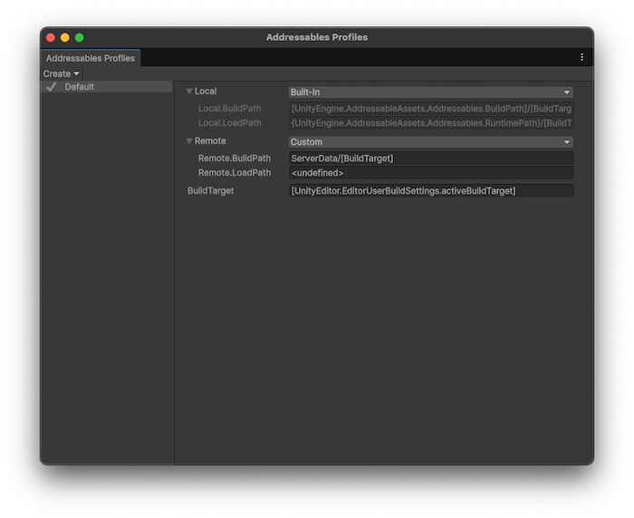

# Addressables Profiles window reference

To manage the profiles in your project, use the **Addressables Profiles window** (menu: __Window > Asset Management > Addressables > Profiles__).

 *The __Addressables Profiles__ window displaying the default profile.*

Right-click a profile name to set it as the active profile, rename the profile, or delete it.

## Create

Use the **Create** menu to create new profiles or variables.

|**Option**|**Description**|
|---|---|
|**Profile**|Create a new profile, based on the selected profile. For more information, refer to [Create a profile](profiles-create.md).|
|**Variable**|Add a single variable to all profiles. For more information, refer to [Add variables to a profile](ProfileVariables.md).|
|**Build and Load Path Variables**|Add a build and load path pair to all profiles. For more information, refer to [Add variables to a profile](ProfileVariables.md).|

## Default variables

The following default profile variables are available:

|**Variable**|**Description**|
|---|---|
| __Local__| Set the variables for local content. Choose from:<ul><li>**Built-In**</li><li>**Cloud Content Delivery**</li><li>**Custom**</li></ul>|
|__Local.BuildPath__|Can only edit if you select **Custom** as the variable. Define where to build the files containing assets you want to install locally with your application. By default, this path is inside the `Library` folder.|
|__Local.LoadPath__| Can only edit if you select **Custom** as the variable. Define where to load assets installed locally with your application. By default, this path is in the `StreamingAssets` folder. Addressables automatically includes local content built to the default location in `StreamingAssets` when you build a Player, but not from other locations.|
|__Remote__| Set the variables for remote content. Choose from:<ul><li>**Built-In**</li><li>**Cloud Content Delivery**</li><li>**Custom**</li></ul>|
|__Remote.BuildPath__|Can only edit if you select **Custom** as the variable. Define where to build the files containing assets you plan to distribute remotely.|
|__Remote.LoadPath__|Can only edit if you select **Custom** as the variable. Define the URL from which to download remote content and catalogs.|
|__BuildTarget__| Set the name of the build target, such as Android or StandaloneWindows64.|

> [!IMPORTANT]
> Usually, you shouldn't need to change the local build or load paths from their default values. If you do, you must manually copy the local build artifacts from your custom build location to the project's [StreamingAssets](xref:SpecialFolders) folder before making a Player build. Changing these paths also precludes building your Addressables as part of the Player build.

Refer to [Builds](Builds.md) for more information about how Addressables uses profiles during content builds.

## Additional resources

* [Create a profile](profiles-create.md)
* [Add variables to a profile](ProfileVariables.md)
* [Set a build and load path](profiles-build-load-paths.md)

