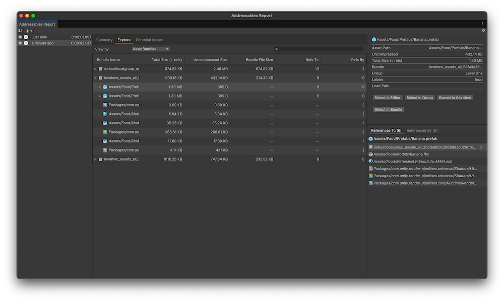

---

uid: addressables-report-overview

---

# Addressables Report window reference

The Addressables Report is a tool that you can use to view information about the content built in an Addressables Build in depth.

To open the Addressables Report window, go to **Window** > **Asset Management** > **Addressables** and select **Addressables Report**.

## Prerequisites

* You must use Unity Editor version 2022.2 or newer. If you want to use the Addressables report, but your current Editor version is below 2022.2, you can use a [build report](BuildLayoutReport.md) built on an earlier version of the Unity Editor and import it into a project uses an Editor version newer than 2022.2, provided that the build report is built on Addressables version 1.21.8 or newer.
* The Addressables Report also requires a [build report](BuildLayoutReport.md) generated by an Addressables build to function. To enable the generation of build reports, go to **Edit** > **Preferences** > **Addressables** and enable the **Debug Build Layout** property.
* By default, the Addressables Report opens automatically after every build. To disable this, go to **Edit** > **Preferences** > **Addressables** and disable **Open Addressables Report After Build**

## Addressables Report window overview

 _Addressables Report window_

The Addressables Report window has the following views:

| __View__  | __Description__ |
|:---|:---|
| [Summary tab](#summary-tab) | Displays a high level overview of the Addressables build and its contents.  |
| [Explore tab](#explore-tab)| Displays a detailed breakdown of all the content built as part of the Addressables build  |
| [Potential Issues tab](AddressablesReportPotentialIssuesTab.md)| Scans the current build report for issues that might affect build performance or otherwise be undesirable. |

Select the tabs along the top of the Addressables Report window to change views.

The left sidebar panel contains the list of all the build reports currently detected within the project. Select a build report in the side bar to load that report in the Addressables Report window.

The right sidebar is the [Inspector Panel](addressables-report-inspector.md), which you can use to view detailed information on an asset or AssetBundle while viewing information within the Explore or Potential Issues views.

Use the search bar in the Build Report window to search within the Explore and Potential Issues tabs. This filters all assets in the current view by the text written in the search bar.

## Summary tab

The Summary tab displays information about the selected build report, along with information about any detected potential issues in the build. It includes the following sections:

* **General Information:** Includes the locations of the catalogs created by the build, which profile the current build was built with, how long the build took, and the version of the Addressables package and the Unity Editor that the build was created with.
* **Potential Issues:** Contains a summary of the issues in the [Potential Issues tab](AddressablesReportPotentialIssuesTab.md)
* **Aggregate Information:** Displays the number of AssetBundles created as part of the build, the size of the bundles built, and the number of assets in the build. The number of assets includes assets that are referenced by an Addressable asset, but aren't marked as Addressable. These assets must be included in the build to allow for assets that depend on them to be loaded.

>[!NOTE]
> If multiple Addressable assets in different bundles depend on the same non-Addressable asset, then that non-Addressable asset is duplicated in multiple bundles. For more information about duplicated assets, refer to [Duplicated Assets View](AddressablesReportPotentialIssuesTab.md).

## Explore tab

The Explore tab has detailed information about the selected build report. Use the **View By** dropdown to change the way that assets are organized in the build report.

You can sort the Explore View in the following ways:

|**View**|**Description**|
|---|---|
|**AssetBundles**| Displays all AssetBundles built as part of the Addressables build. Expand an AssetBundle to display the assets that bundle contains. This is the default view.|
|**Assets**| Displays all assets built as part of the Addressables build. Expanding an asset to display all assets and AssetBundles that depend on the expanded asset.|
|**Labels**| Displays all the assets built as part of the Addressables build, sorted by the label attached to the Asset. Expand an asset to display the assets and AssetBundles that depend on the expanded asset.|
|**Groups**| Displays all the AssetBundles built as part of the Addressables build, sorted by which [group](Groups.md) generated the bundle. If you use the **Pack Together By Label** or **Pack Separately** group settings, it's possible for multiple AssetBundles to be generated by a single group.|

When you select an asset in the Explore Tab, its information is displayed in [the Inspector panel](addressables-report-inspector.md).

## Potential Issues tab

The Potential Issues tab scans the selected build report for any potential issues or problems that might have happened as part of your build. You can then view how these issues might have happened. It has the following view:

* **Duplicated Assets View**: Displays a list of all of the non-Addressable assets that are duplicated between multiple bundles in your build. This happens when two addressable assets are in different bundles, but both reference a common asset that is not marked as addressable.

To fix these issues, either move the Addressable assets into the same bundle, or make the asset Addressable. Either means of fixing it will have implications on your build dependencies. You should usually use whichever method minimizes the impact on having the asset duplicated.

Selecting an asset in the Potential Issues Tab opens its information in [the Inspector panel](addressables-report-inspector.md).
