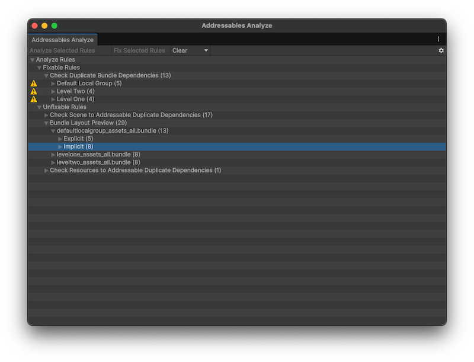

# Addressables Analyze window reference

Use the **Addressables Analyze** window to analyze the layout of the Addressables assets in your project. To open the window go to **Window** > **Asset Management** > **Addressables** > **Analyze**.

*The Addressables Analyze window with some data loaded.*

## Toolbar

|**Operation**|**Description**|
|---|---|
|**Analyze Selected Rules**| Starts the analysis for any selected rules or their children.|
|**Fix Selected Rules**| Performs the fix action for any selected rules or their children (must be a Fixable rule).|
|**Clear**| Opens the clear options to clear the results for any selected rules or their children.|
|**Options** (gear icon)| Opens the options to import a saved analysis result or export results to disk.|

## Fixable rules

Fixable rules are rules that Unity can automatically fix with the **Fix Selected Rules** operation.

|**Rule**|**Description**|
|---|---|
|**Check Duplicate Bundle Dependencies**|Checks for duplicated assets by scanning all groups with [BundledAssetGroupSchemas](GroupSchemas.md) and projecting the asset group layout. This requires triggering a full build, so this check is time-consuming and performance-intensive.|

## Unfixable rules

Unfixable rules are those that are informational and have no appropriate action to fix them.

|**Rule**|**Description**|
|---|---|
|**Check Scene to Addressable Duplicate Dependencies**|Detects any assets or asset dependencies that are shared between the scenes in the Editor Scene list and Addressables. These duplicates mean that data is included in both the application build and the Addressables build.|
|**Bundle Layout Preview**|Displays how assets explicitly marked as Addressable are laid out in the Addressable build. Given these explicit assets, the window also displays what assets are implicitly referenced by, and therefore will be pulled into, the build.|
|**Check Resources to Addressable Duplicate Dependencies**|Detects if any assets or asset dependencies are duplicated between built Addressable data and assets residing in a `Resources` folder. These duplicates mean that data is included in both the application build and the Addressables build. One possible way to fix this issue is to move the assets out of the `Resources` folder and make them Addressable.|

## Additional resources

* [Addressables Analyze window](analyze-addressables-window.md)
* [Create custom rules for Addressables Analyze](analyze-custom-rules.md)