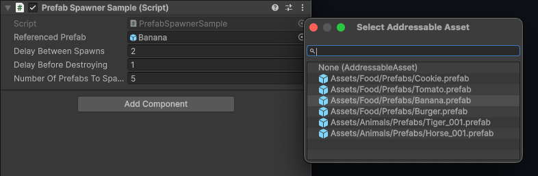

# Introduction to asset references

To reference Addressable assets in your code, use the [`AssetReference`](xref:UnityEngine.AddressableAssets.AssetReference) type in a `MonoBehaviour` or `ScriptableObject` script. When you add a serializable `AssetReference` field to one of these classes, you can assign a value to the field in an Inspector window. You can optionally restrict the field to [only accept certain asset types](#assetreference-types) or [labels](Labels.md).

 *An Inspector window displaying a **Referenced Prefab** `AssetReferenceGameObject` field. The object picker displays Addressable prefabs to choose from.*

To assign a value, drag an asset to the field or select the object picker icon to open a dialog that lets you choose an Addressable asset.

If you drag a non-Addressable asset to an `AssetReference` field, Unity automatically makes the asset Addressable and adds it to the [default Addressables group](groups-create.md). Sprite and SpriteAtlas assets can have sub objects and display an additional object picker that you can use to specify which sub object to reference.

> [!IMPORTANT]
> To assign assets from a group to an AssetReference field, you must enable the __Include GUIDs in Catalog__ property in the group's Advanced Options. The __Include GUIDs in Catalog__ option is enabled by default. For more information, refer to [Group Inspector settings reference](ContentPackingAndLoadingSchema.md).

## AssetReference types

The Addressables API provides [`AssetReference`](xref:UnityEngine.AddressableAssets.AssetReference) subclasses for common types of assets. You can use the generic subclass, [`AssetReferenceT<TObject>`](xref:UnityEngine.AddressableAssets.AssetReferenceT`1), to restrict an AssetReference field to other asset types.

The types of AssetReference include:

|**AssetReference type**|**Description**|
|---|---|
|[`AssetReference`](xref:UnityEngine.AddressableAssets.AssetReference)| Can reference any asset type|
|[`AssetReferenceT<TObject>`](xref:UnityEngine.AddressableAssets.AssetReferenceT`1)| Can reference assets that are the same type as `TObject`|
|[`AssetReferenceTexture`](xref:UnityEngine.AddressableAssets.AssetReferenceTexture)| Can reference a `Texture` asset.|
|[`AssetReferenceTexture2D`](xref:UnityEngine.AddressableAssets.AssetReferenceTexture2D)| Can reference a `Texture2D` asset.|
|[`AssetReferenceTexture3D`](xref:UnityEngine.AddressableAssets.AssetReferenceTexture3D)| Can reference a `Texture3D` asset.|
|[`AssetReferenceGameObject`](xref:UnityEngine.AddressableAssets.AssetReferenceGameObject)| Can reference a `Prefab` asset.|
|[`AssetReferenceAtlasedSprite`](xref:UnityEngine.AddressableAssets.AssetReferenceAtlasedSprite)| Can reference a `SpriteAtlas` asset.|
|[`AssetReferenceSprite`](xref:UnityEngine.AddressableAssets.AssetReferenceSprite)| Can reference a single `Sprite` asset.|

> [!NOTE]
> If you want to use a [`CustomPropertyDrawer`](xref:editor-PropertyDrawers) with a generic `AssetReferenceT`, or are using a version of Unity earlier than 2020.1, you must make a concrete subclass to support custom `AssetReference` types.

## Additional resources

* [Create an asset reference field](asset-reference-create.md)
* [Load asset references](LoadingAssetReferences.md)
* [`AssetReference` API reference](xref:UnityEngine.AddressableAssets.AssetReference)