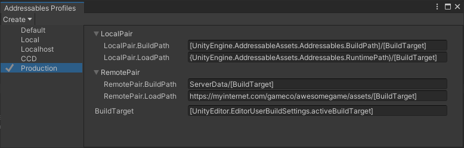

# Profiles

A profile contains a set of variables used by the Addressables build scripts. These variables define information such as where to save build artifacts and where to load data at runtime. You can add custom profile variables to use in your own build scripts.

Open the Profiles window (menu: __Window > Asset Management > Addressables > Profiles__) to edit profile values and create new profiles.

 *The __Addressables Profiles__ window showing the default profile.*

You can set up different profiles for the different phases or tasks in your development process. For example, you could create one profile to use while developing your project, one to use for testing, and one to use for final publishing or release. Setting up the profiles in advance and swapping between them is much less error prone than editing the values individually when you move to a different phase or perform a different task.

Right-click a profile name to set it as the active profile, rename the profile, or delete it.

Addressables defines five profile variables by default:

* __Local__: defines two path variables for local content:
  * __Local.BuildPath__: where to build the files containing assets you want to install locally with your application. By default, this path is inside your Project Library folder.
  * __Local.LoadPath__: where to load assets installed locally with your application. By default, this path is in the StreamingAssets folder. Addressables automatically includes local content built to the default location in StreamingAssets when you build a Player (but not from other locations).
* __Remote__: defines two path variables for remote content:  
  * __Remote.BuildPath__: where to build the files containing assets you plan to distribute remotely.
  * __Remote.LoadPath__: the URL from which to download remote content and catalogs. 
* __BuildTarget__: the name of the build target, such as Android or StandaloneWindows64

You can choose the following pre-defined __Bundle Locations__ for the __Local__ and __Remote__ path variables:

* __Built-In__: the path definitions for local content. The build system automatically includes content built with this setting in your Player builds. You should not change these path values.
* __Editor Hosted__: the path definitions to use with the Editor [Hosting service]. Depending on how you set up the hosting service, you might need to edit the load path to match the service URL.
* __Cloud Content Delivery__: the path definitions for the __Unity Cloud Content Delivery__ (CCD) service. Requires creating a Unity Project ID in the __Services__ section of your Project settings (or linking to an existing ID). You must also install the __CCD Management SDK__ package. See [Addressable Asset system with Cloud Content Delivery] for information about setting up and using the __Cloud Content Delivey__ __Bundle Location__ option.
* __Custom__: Allows you to edit the values used for the build and load paths. See [Profile variable syntax] for information about setting a variable value using placeholders that Addressables evaluates at build-time and runtime.

> [!WARNING]
> In most cases, you should not change the local build or load paths from their default values. If you do, you must manually copy the local build artifacts from your custom build location to the project's [StreamingAssets] folder before making a Player build. Altering these paths also precludes building your Addressables as part of the Player build. 

See [Builds] for more information about how Addressables uses profiles during content builds.

> [!TIP]
> Using multiple profiles is most helpful when you distribute content for your application remotely. If you distribute all content as part of your application install, then the single, default profile might be the only profile you need.

## Setting the active profile

The active profile determines the set of variables used when you run a build script.

To set the active profile, either:

1. Open the Groups window (menu: __Window > Asset Management > Addressables > Groups__).
2. Click the __Profile__ menu in the toolbar.
3. Choose the profile to make active.

Or:

1. Open the Profiles window (menu: __Window > Asset Management > Addressables > Profiles__).
2. Right- or cmd-click on a profile to open the context menu.
3. Choose __Set Active__.

> [!NOTE]
> Build scripts include the [Play Mode Scripts] that Addressables invokes when you enter Play mode in the Editor. Some Play Mode scripts use variables from the active profile to locate content. See [Play Mode Scripts] for more information. 

## Adding a new profile

To create a new profile, select __Create__ > __Profile__. A new profile row appears in the table.

Every profile must define a value for every variable. When you create a new profile, Addressables copies all values from the currently selected profile.

## Profile variables

See [Profile Variables] for more information on how to use profile variables. 

## Specifying packing and loading paths

Once you set up the necessary variables in your profile, you can select the build and load paths for an asset group based on those specified variables.

To set your build and load paths:

1. Select an Addressable Assets group from the __Project__ window.
2. In the group’s __Inspector__, under __Content Packing & Loading__ > __Build and Load Paths__, select the desired path pair. If you choose the `<custom>` option, you can specify the build and load paths separately.

Notice that you do not enter the path directly, but rather select a variable representing the path defined in the __Profiles__ window earlier. The __Path Preview__ shows the current path, based on the active Profile. To edit a path directly in the Group settings Inspector, set __Build & Load Paths__ to `<custom>` and also set the individual __Build__ or __Load Path__ to `<custom>`. The edited path applies to that group only.

## Profile examples

Consider the following example, demonstrating the local development phase of your content.

 *Content with local and remote bundles stored locally for development.*

While in development, you would have both your local and remote bundles using local paths, as seen below.

 *Paths set for local development.*

In this instance, you can see that the local and remote paths are in fact local, which makes it unnecessary to set up a remote server just for local development. 

Once the content is ready for production, you would move the remote bundles to a server, as the diagram below shows.

 *Content with the remote bundles moved to a server for production.*

In this case, using profiles, you could change the remote load path for "Production" to that server. Without having to change your asset groups, you can change all of your remote bundles to actually become remote.

 *Paths set for hosting remote content*

> [!IMPORTANT]
> * The Addressables system only copies data from [Addressables.BuildPath] to the StreamingAssets folder during a Player build -- __it does not handle arbitrary paths specified through the LocalBuildPath or LocalLoadPath variables__. If you build data to a different location or load data from a different location than the default, you must copy the data manually. 
> * Similarly, you must manually upload remote AssetBundles and associated catalog and hash files to your server so that they can be accessed at the URL defined by __RemoteLoadPath__.

[path setting]: xref:addressables-content-packing-and-loading-schema#build-and-load-paths
[Group]: xref:addressables-groups
[Builds]: xref:addressables-builds
[Managed code stripping]: xref:ManagedCodeStripping
[Play Mode Scripts]: xref:addressables-groups-window#play-mode-scripts
[Profile variable syntax]: xref:addressables-profile-variables#profile-variable-syntax
[UnityEditor.EditorUserBuildSettings.activeBuildTarget]: xref:UnityEditor.EditorUserBuildSettings.activeBuildTarget
[UnityEngine.AddressableAssets.Addressables.BuildPath]: xref:UnityEngine.AddressableAssets.Addressables.BuildPath
[UnityEngine.AddressableAssets.Addressables.RuntimePath]: xref:UnityEngine.AddressableAssets.Addressables.RuntimePath
[Addressables.BuildPath]: xref:UnityEngine.AddressableAssets.Addressables.BuildPath
[StreamingAssets]: xref:SpecialFolders
[remote catalog]: xref:addressables-asset-settings#content-update
[Addressable Asset system with Cloud Content Delivery]: xref:addressables-ccd
