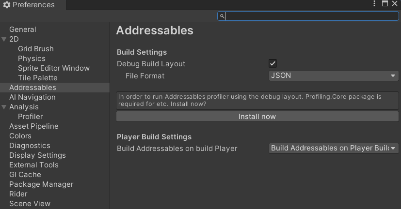
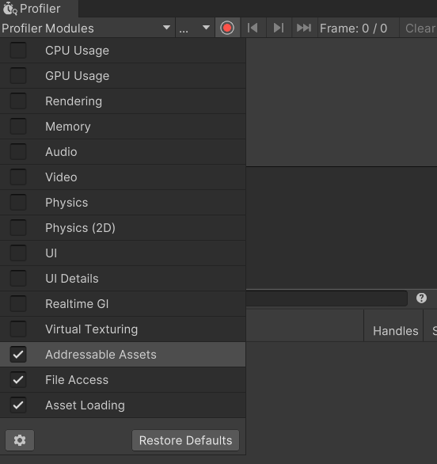
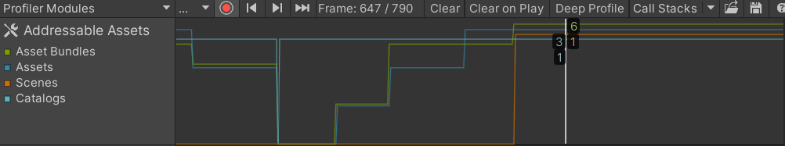
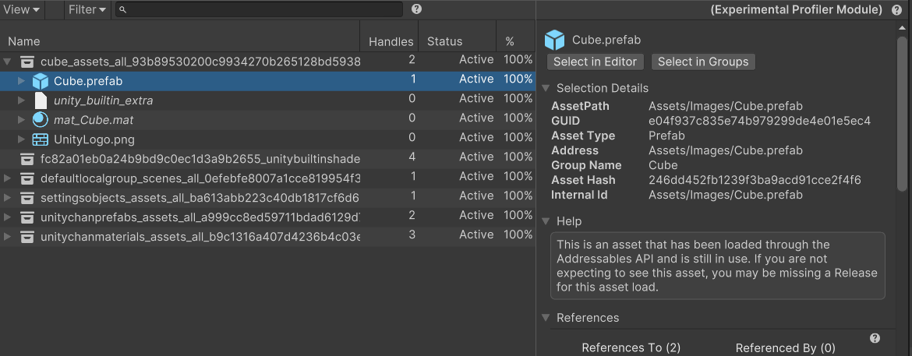
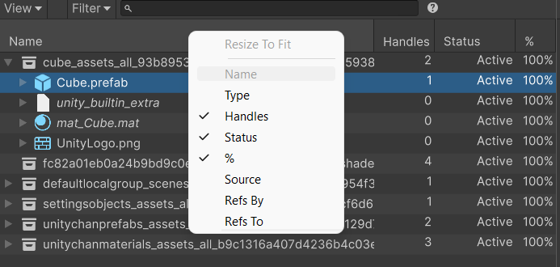
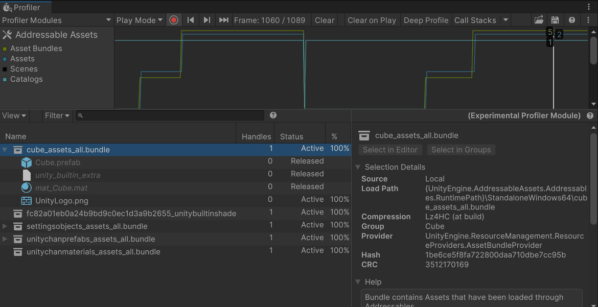

# Profiler Module

The Addressables Profiler is a Unity Editor profiler module that can be used to determine what content is loaded from Addressables.

## Requirements

* Basic profiler usage supported from 2021 or newer. To view detailed profiler information 2022.2 or newer is required. All information in this documentation is for editor version 2022.2.

* Build Reports must be enabled and the runtime being profiled requires a build report. To enable build reports, go to your editor preferences, select the Addressables preferences. Then enable “Debug Build Layout”.

* Collecting information about the running content requires build time data collection information for the debug build layout. These files are stored in the folder <Project Directory>/Library/com.unity.addressables/buildReports. Each build you make creates a new build report file in this directory. When running the profiler, any incoming profiler data from the profiler target will be synced and look for the build report file for that runtime in the buildReports folder. If the build report does not exist, such as if the project was built using a different machine. Then the profiler will not display the information for that data. Selecting “Find in file system” will open a file select window. Which can be used to locate a build report file on disk elsewhere.

* Package Unity Profiling Core API is required for the profiler to run. To install this package either install through the package manager or though the Addressables preferences window when enabling the Debug Build Layout.

* Running in editor. Profiler module does not support Play Mode Scripts; “Use Asset Database (Fastest)” or “Simulate Groups (Advanced)”. Requiring the content to be built and using “Use Existing Build” based play mode scripts.

## Opening the Profiler Module

To enable the profiler; Open the profiler window. __Window__ > __Analysis__ > __Profiler__. In the top right of the profiler window select the dropdown button labeled __Profiler Modules__. Enable the option named __Addressable Assets__.

## Viewing the Module

The module view can be used to observe how many Asset Bundles, Assets, Scenes and Catalogs are loaded at the frame in time.

Shown below we have 3 Assets and 1 Scene, from 1 Catalog, and 6 Asset Bundles.

When a frame is selected. The detail pane will fill with information for that frame. Displaying a tree view for the loaded content.
To modify which content is displayed. Select the detail pane toolbar dropdown button “View”. Giving view options.
* __Groups__: Includes Groups in the tree view.
* __Asset Bundles__: Includes Asset Bundles in the tree view.
* __Assets__: Includes Assets in the tree view.
* __Objects__: Includes which objects are loaded within an Asset.
* __Assets not loaded__: This will also show assets that are within a loaded bundle, but not actively loaded.

The details pane is made up of two regions. On the left side is the Tree View of the content, which is used to view loaded content and is expanded into more in depth content. On the right side is the details inspector, which shows detailed information for the content selected from the Tree View.

## Content Tree View

The Tree View columns can be enabled or disabled based on your preferences. Context click on the Tree View header to display a list of the available columns.

Each column will show information depending on the content in the row.
* __Name__: Is the Group name, Asset Bundle file name, Asset will be the address of the asset, or the asset path if the address is not used. Object will be the object name, or asset type for scenes.
* __Type__: Is the Type for the Asset or Object.
* __Handles__: Is how many Addressables handles are actively holding onto the content. This is often referred to as Reference Count. During loading there is an additional handle to the content.
* __Status__: Is what the state of the content at the time, this can be:
* * __Queued__: When an Asset Bundle is in the download queue.
* * __Downloading__: When an Asset Bundle is being downloaded.
* * __Loading__: When the content is being loaded in the background.
* * __Active__: When the content is loaded and in use.
* * __Released__: When content has been released (no more active handles to the content) and may still be in memory. See [Memory management]
* __%__: When the status is downloading or loading, this displays the percentage progress of the download or load operation.
* __Source__: For Asset Bundles only, will indicate either:
* * __Local__: The Asset Bundle was loaded from a local file on disk.
* * __Cache__: The Asset Bundle had previously been downloaded and cached to disk. Loading was from the cached file.
* * __Download__: The Asset Bundle had not been cached and needed to be downloaded.
* __Refs By__: How many of another element references this content element.
* __Refs To__: How many other elements the content references.

## Released Assets

When content is released from Addressables. It may still be in memory until all content from the Asset Bundle is released, and any other Asset Bundle that can have a dependency on any Asset within the Asset Bundle is also released.

The following screenshot shows the “cube_assets_all.bundle” has some content that is released and some other content (UnityLogo.png) that is still in use. Released content is easier to distinguish by the faded font color.

See [Memory management] for more information about managing the memory associated with your Addressable assets.

## Filtering Content

The details view toolbar has a search bar. This can be used to filter by the content Name. Other fields can be filtered using search filter syntax as shown below:

Filter syntax is <tag>:<evaluation>. Where the field is a numerical field. Such as “handles:3”, the default equality is =. This can be changed to greater than “>” or less than “<” by including the symbol before the number, for example. “Handles:>2”.

Each filter can be written as the column name (without a space), or with the shorthand tag as below.

* __Handles__: “h”
* __Type__: “assetType”, “t”
* __Status__: “s”
* __RefsTo__: “rt”, “r”
* __RefsBy__: “rb”, “p”
* __Source__: “bundlesource”, “bs”, “b”

The type filter can also be used to filter by inclusion type. Explicit where an Asset is explicitly included into a Group through Addressables. Or Implicit, where the Asset was included into the Asset Bundle because another included references it. E.g. “type:explicit”

## Inspecting Content Details

The Inspector pane can be used to gather more detailed information about content. Help on how content is loaded, and reference to and by the selected element.

Below is an example of the inspector for a loaded Asset Bundle.

 Contains any detailed information. This can be used to get more information about the element you have selected.

 Contains any information that may be useful to know. Including any hints for any settings that may not be intended.

 Contains references to other Asset Bundles. Here we see that This Asset Bundle has content that references one other Asset Bundle, and there is one other Asset Bundle that has content that references this element.

[Memory management]: xref:addressables-memory-management
