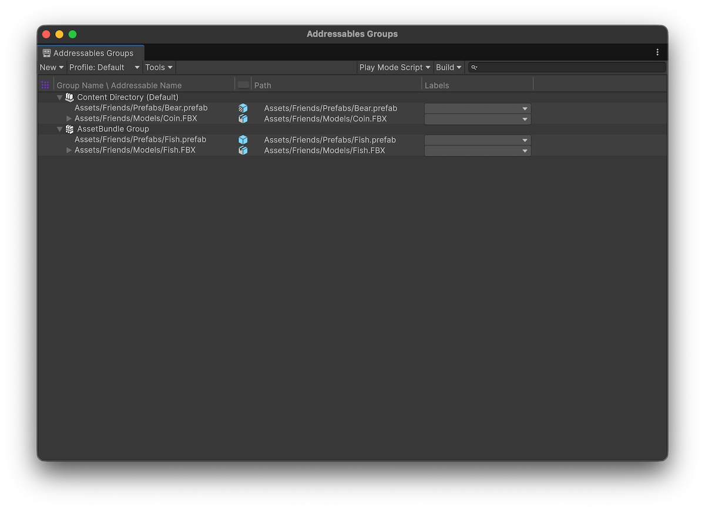

# Introduction to Addressable asset groups

Understand how to use groups to organize Addressable assets, control build paths, load paths, and AssetBundle packaging strategies.

A group is the main organizational unit of the Addressables system. Create and manage groups and the assets they contain with the **[Addressables Groups window](GroupsWindow.md)**.

To control how Unity handles assets during a content build, organize Addressables into groups and assign different settings to each group as required.

You can optionally use the **[Auto Group Generator window](groups-auto-group-generator.md)** to automatically generate optimized groups for assets and their dependencies.

  *The Addressables Groups window showing the toolbar and list of groups and assets.*

The build scripts use groups to determine how to build your project's content, depending on the [content build system](groups-create.md) you're using:

* **AssetBundles**: The build uses groups to determine the number of AssetBundles to create and where to create them from both the [settings of the group](GroupSchemas.md) and the [Addressables system settings](AddressableAssetSettings.md).
* **Content directories**: Creates one content directory that includes all groups.

For more information, refer to [Builds](Builds.md).

> [!NOTE]
> Addressable groups only exist in the Unity Editor. The Addressables runtime code doesn't use a group concept. However, you can [assign a label](Labels.md) to the assets in a group if you want to find and load all the assets that were part of that group. For more information, refer to [Loading Addressable assets](LoadingAddressableAssets.md).

Unity saves the groups you create in the `AssetGroups` subfolder of `AddressableAssetsData`. When you select a group in this folder, you can use the Inspector to define how Unity creates and outputs a content build.

For full details of each setting, refer to [Group Inspector settings reference](group-inspector-settings-reference.md).

You can also use profile variables to automatically set these paths. For more information, refer to [Profiles](AddressableAssetsProfiles.md).

## Additional resources

* [Add assets to groups](groups-create.md)
* [Define group settings](GroupSchemas.md)
* [Labelling assets](Labels.md)
* [Addressables Groups window reference](GroupsWindow.md)
* [Introduction to loading Addressable assets](load-addressable-assets.md)
