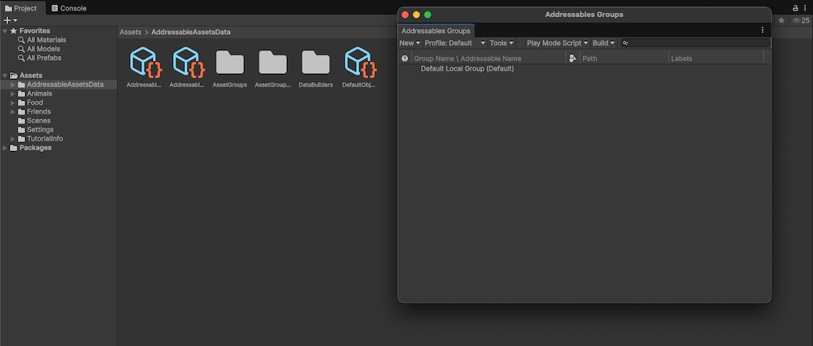

# Install Addressables

To install the Addressables package in your project, use the Package Manager:

1. Open the Package Manager (menu: __Window > Package Manager__).
1. Set the package list to display packages from the __Unity Registry__.
1. Select the Addressables package in the list.
1. Click __Install__ (at the bottom, right-hand side of the Package Manager window).

To set up the Addressables system in your Project after installation, open the __Addressables Groups__ window and click __Create Addressables Settings__. 

 *Before initializing the Addressables system in a Project*

When you run the __Create Addressables Settings__ command, the Addressables system creates a folder called, `AddressableAssetsData`, in which it stores settings files and other assets it uses to keep track of your Addressables setup. You should add the files in this folder to your source control system. Note that Addressables can create additional files as you change your Addressables configuration. Refer to [Addressables Settings](AddressableAssetSettings.md) for more information about the settings.

> [!NOTE]
> For instructions on installing a specific version of Addressables or for general information about managing the packages in a Project, refer to [Packages](xref:PackagesList).
