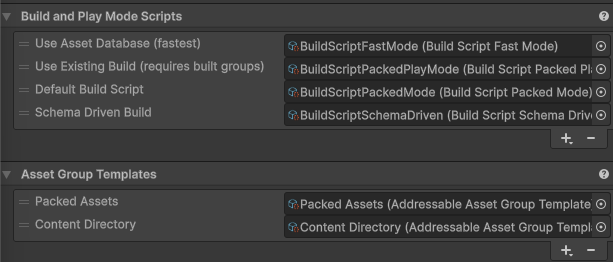

# Known issues

This page lists known issues in the Addressables package and the workarounds to resolve them.

## Content Directory artifacts left behind after downgrading from Addressables 3.0.0+ break builds and the Report window

If a project ever had Addressables 3.0.0+ installed and is then downgraded to an earlier version (for example, 2.11.1), the Content Directory build script and group template introduced by 3.0.0+ remain registered in the project's Addressable Asset Settings. Earlier versions of Addressables don't support these objects, which leads to the following symptoms:

* The **Content Directory** group type appears as an available option when you create a new group, even though the installed version doesn't support it. Adding it logs `Cannot add null Schema object` and `Invalid index for data builder` warnings.
* Any Addressables build logs multiple `Object reference not set to an instance of an object` errors (originating from `UnityEditor.GenericMenu:CatchMenu`).
* The [Addressables Report window](addressables-report-window.md) fails to load correctly and continuously logs errors.

To resolve these issues, remove the unsupported objects from the Addressable Asset Settings and clear the affected build reports as follows:

1. Open the Addressable Asset Settings Inspector (menu: **Window** &gt; **Asset Management** &gt; **Addressables** &gt; **Settings**).
2. Expand the [**Build and Play Mode Scripts**](AddressableAssetSettings.md#build-and-play-mode-scripts) section. Select the **Schema Driven Build** entry, and select the **&minus;** button at the bottom of the list to remove it.
3. Expand the [**Asset Group Templates**](AddressableAssetSettings.md#asset-group-templates) section. Select the **Content Directory** entry, and select the **&minus;** button at the bottom of the list to remove it.
4. If the Report window still logs errors, remove the affected build reports from the build report list in the left sidebar panel of the Addressables Report window. To do this, right-click in the window and select **Remove Report** to remove the selected report, or **Remove All Reports** to remove them all.

 *The Schema Driven Build script and Content Directory group template. Select each entry and use the &minus; button beneath its list to remove it.*

## Additional resources

* [Addressable Asset Settings reference](AddressableAssetSettings.md)
* [Addressables Report window reference](addressables-report-window.md)
