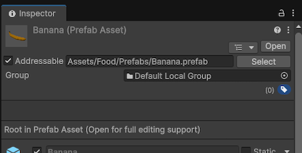

# Introduction to creating and organizing Addressable assets

Understand how to make assets Addressable and organize them using groups, profiles, and the Addressable Asset Settings window.

To create and organize Addressable assets, you must do the following:

* [Assign an asset as addressable](#assign-an-asset-as-addressable).
* [Organize Addressable assets with groups](#manage-addressable-groups), which determine where Unity loads assets from and builds them to, and how the content is compressed.

Once you make an asset Addressable, the Addressables system adds it to a default group, unless you place it in a specific group. When you make a [content build](xref:addressables-builds), Unity packs assets in a group into [AssetBundles](xref:AssetBundlesIntro) according to the group's settings. You can load these assets using the [Addressables API](xref:addressables-api-load-asset-async).

You can optionally use [profiles](AddressableAssetsProfiles.md) to create variables for the build process, and use [labels](Labels.md) to determine how to group Addressable assets together.

To customize Addressable settings on a project level, use the [Addressable Asset Settings window](AddressableAssetSettings.md).

## Assign an asset as Addressable

You can make an asset Addressable in the following ways:

* Enable the **Addressable** checkbox in the Inspector window for either the asset itself or for its parent folder.
* Drag the asset into a group in the [Addressables Groups](GroupsWindow.md) window.
* Drag or assign the asset to an [AssetReference](AssetReferences.md) field in the Inspector window.

 _A Banana prefab asset with the Addressable option enabled. It's assigned to the default group._

> [!NOTE]
> If you make an asset in a [Resources folder](xref:um-loading-resources-at-runtime) Addressable, Unity moves the asset out of the Resources folder. You can move the asset to a different folder in your Project, but you can't store Addressable assets in a Resources folder.

## Manage Addressable groups

To manage Addressable assets, use the [Addressables Groups](groups-intro.md) window. Use this window to create Addressables groups, move assets between groups, and assign addresses and labels to assets.

  *The Addressables Groups window showing the toolbar and list of groups and assets.*

When you first install and set up the Addressables package, it creates a default group for Addressable assets. The Addressables system assigns any assets you mark as Addressable to this group by default. You can create more groups to further organize the assets in your project and define when and how Unity builds and loads them.

For more information, refer to [Organize assets into groups](groups-intro.md).

## Referencing Addressable assets

To organize assets in the Unity Editor, you can use [`AssetReference`](xref:UnityEngine.AddressableAssets.AssetReference), which is a type that can reference an Addressable asset. You can include `AssetReference` fields in `MonoBehaviour` and `ScriptableObject` classes and then in the Unity Editor assign assets to these fields in the Inspector.

For more information, refer to [Referencing Addressable assets in code](AssetReferences.md).

## Strategies for organizing assets

Typical strategies for organizing assets include:

* **Concurrent usage**: Group assets that you load at the same time together, such as all the assets for a given level. This strategy is often the most effective in the long term and can help reduce peak memory use in a project.
* **Logical entity**: Group assets belonging to the same logical entity together. For example, UI layout assets, textures, sound effects, character models, and animations.
* **Type**: Group assets of the same type together. For example, music files, or textures.

Depending on the needs of your project, one of these strategies might make more sense than the others. For example, in a game with many levels, organizing according to concurrent usage might be the most efficient both from a project management and from a runtime memory performance standpoint.

You can also use different strategies for different types of assets. For example, in a level-based game you can group all UI assets for menu screens together, and group level data separately. You might also pack a group that has the assets for a level into bundles that contain a particular asset type.

For more information on organizing assets, refer to [Organizing assets into AssetBundles](xref:um-asset-bundles-preparing). While this documentation focuses on AssetBundle organization, the approaches can be also applied to Addressables.

## Additional resources

* [Addressable asset groups](groups-intro.md)
* [Referencing Addressable assets in code](AssetReferences.md)
* [Building Addressable assets](Builds.md)
* [Addressables Groups window reference](GroupsWindow.md)