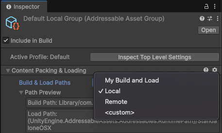

# Set a build and load path

Once you set up the necessary [variables](ProfileVariables.md) in your profile, you can select the build and load paths for an asset group based on those specified variables.

To set build and load paths:

1. Select an Addressable Assets group from the __Project__ window.
2. In the group's __Inspector__, under __Content Packing & Loading__ > __Build and Load Paths__, select the desired path pair. If you choose the `<custom>` option, you can specify the build and load paths separately.

You need to select a variable representing the path defined in the __Profiles__ window rather than entering a path directly. The __Path Preview__ displays the current path, based on the active Profile. To edit a path directly, in the [group settings Inspector](GroupSchemas.md), set __Build & Load Paths__ to `<custom>` and set the individual __Build__ or __Load Path__ to `<custom>`. The edited path applies to that group only.

 *The Group Inspector with the Build & Load Paths dropdown selected. The dropdown displays a custom path pair, My Build and Load.*

## Additional resources

* [Create a profile](profiles-create.md)
* [Add variables to a profile](ProfileVariables.md)
* [Addressables Profiles window reference](addressables-profiles-window.md)